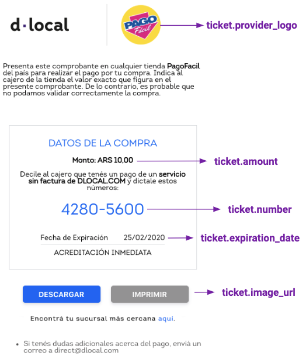

# Argentina

### Payment Methods Available

<table>
  <thead>
    <tr>
      <th style="text-align:left"><code>payment_<br />method_id</code>
      </th>
      <th style="text-align:left"><b>Name</b>
      </th>
      <th style="text-align:left"><code>payment_<br />method_type</code>
      </th>
      <th style="text-align:left"><code>brand</code>
      </th>
      <th style="text-align:left"><b>Details</b>
      </th>
      <th style="text-align:left">Allowed Flows</th>
      <th style="text-align:left"><b>Logo</b>
      </th>
    </tr>
  </thead>
  <tbody>
    <tr>
      <td style="text-align:left"><code>IO</code>
      </td>
      <td style="text-align:left">Bank Transfer</td>
      <td style="text-align:left"><code>BANK_TRANSFER</code>
      </td>
      <td style="text-align:left"></td>
      <td style="text-align:left">Bank Transfer Offline</td>
      <td style="text-align:left">
        <p><code>DIRECT</code>
        </p>
        <p><code>REDIRECT</code>
        </p>
      </td>
      <td style="text-align:left">&#x200B;https://static.dlocal.com/views/2.0/images/payments/VS.png</td>
    </tr>
    <tr>
      <td style="text-align:left"><code>PF</code>
      </td>
      <td style="text-align:left">Pago F&#xE1;cil</td>
      <td style="text-align:left"><code>TICKET</code>
      </td>
      <td style="text-align:left"></td>
      <td style="text-align:left">Cash Payment</td>
      <td style="text-align:left">
        <p><code>DIRECT</code>
        </p>
        <p><code>REDIRECT</code>
        </p>
      </td>
      <td style="text-align:left">&#x200B;<a href="https://static.dlocal.com/images/providers/PF.png">https://static.dlocal.com/images/providers/PF.png</a>
      </td>
    </tr>
    <tr>
      <td style="text-align:left"><code>RP</code>
      </td>
      <td style="text-align:left">Rapi Pago</td>
      <td style="text-align:left"><code>TICKET</code>
      </td>
      <td style="text-align:left"></td>
      <td style="text-align:left">Cash Payment</td>
      <td style="text-align:left">
        <p><code>DIRECT</code>
        </p>
        <p><code>REDIRECT</code>
        </p>
      </td>
      <td style="text-align:left"><a href="https://static.dlocal.com/images/providers/RP.png">https://static.dlocal.com/images/providers/RP.png</a>
      </td>
    </tr>
    <tr>
      <td style="text-align:left"><code>CARD</code>
      </td>
      <td style="text-align:left">Visa</td>
      <td style="text-align:left"><code>CARD</code>
      </td>
      <td style="text-align:left"><code>VI</code>
      </td>
      <td style="text-align:left">Credit Card</td>
      <td style="text-align:left">
        <p><code>DIRECT</code>
        </p>
        <p><code>REDIRECT</code>
        </p>
      </td>
      <td style="text-align:left">&#x200B;<a href="https://pay.dlocal.com/views/2.0/images/payments/VI.png">https://pay.dlocal.com/views/2.0/images/payments/VI.png</a>&#x200B;</td>
    </tr>
    <tr>
      <td style="text-align:left"><code>CARD</code>
      </td>
      <td style="text-align:left">MasterCard</td>
      <td style="text-align:left"><code>CARD</code>
      </td>
      <td style="text-align:left"><code>MC</code>
      </td>
      <td style="text-align:left">Credit Card</td>
      <td style="text-align:left">
        <p><code>DIRECT</code>
        </p>
        <p><code>REDIRECT</code>
        </p>
      </td>
      <td style="text-align:left">&#x200B;<a href="https://pay.dlocal.com/views/2.0/images/payments/MC.png">https://pay.dlocal.com/views/2.0/images/payments/MC.png</a>&#x200B;</td>
    </tr>
    <tr>
      <td style="text-align:left"><code>CARD</code>
      </td>
      <td style="text-align:left">American Express</td>
      <td style="text-align:left"><code>CARD</code>
      </td>
      <td style="text-align:left"><code>AE</code>
      </td>
      <td style="text-align:left">Credit Card</td>
      <td style="text-align:left">
        <p><code>DIRECT</code>
        </p>
        <p><code>REDIRECT</code>
        </p>
      </td>
      <td style="text-align:left">&#x200B;<a href="https://pay.dlocal.com/views/2.0/images/payments/AE.png">https://pay.dlocal.com/views/2.0/images/payments/AE.png</a>&#x200B;</td>
    </tr>
    <tr>
      <td style="text-align:left"><code>CARD</code>
      </td>
      <td style="text-align:left">Diners</td>
      <td style="text-align:left"><code>CARD</code>
      </td>
      <td style="text-align:left"><code>DC</code>
      </td>
      <td style="text-align:left">Credit Card</td>
      <td style="text-align:left">
        <p><code>DIRECT</code>
        </p>
        <p><code>REDIRECT</code>
        </p>
      </td>
      <td style="text-align:left">&#x200B;<a href="https://pay.dlocal.com/views/2.0/images/payments/DC.png">https://pay.dlocal.com/views/2.0/images/payments/DC.png</a>&#x200B;</td>
    </tr>
    <tr>
      <td style="text-align:left"><code>CARD</code>
      </td>
      <td style="text-align:left">CMR Falabella</td>
      <td style="text-align:left"><code>CARD</code>
      </td>
      <td style="text-align:left"><code>CM</code>
      </td>
      <td style="text-align:left">Credit Card</td>
      <td style="text-align:left">
        <p><code>DIRECT</code>
        </p>
        <p><code>REDIRECT</code>
        </p>
      </td>
      <td style="text-align:left">&#x200B;<a href="https://pay.dlocal.com/views/2.0/images/payments/CM.png">https://pay.dlocal.com/views/2.0/images/payments/CM.png</a>&#x200B;</td>
    </tr>
    <tr>
      <td style="text-align:left"><code>CARD</code>
      </td>
      <td style="text-align:left">Tarjeta Naranja</td>
      <td style="text-align:left"><code>CARD</code>
      </td>
      <td style="text-align:left"><code>NJ</code>
      </td>
      <td style="text-align:left">Credit Card</td>
      <td style="text-align:left">
        <p><code>DIRECT</code>
        </p>
        <p><code>REDIRECT</code>
        </p>
      </td>
      <td style="text-align:left">&#x200B;<a href="https://pay.dlocal.com/views/2.0/images/payments/NJ.png">https://pay.dlocal.com/views/2.0/images/payments/NJ.png</a>&#x200B;</td>
    </tr>
    <tr>
      <td style="text-align:left"><code>CARD</code>
      </td>
      <td style="text-align:left">Tarjeta Shopping</td>
      <td style="text-align:left"><code>CARD</code>
      </td>
      <td style="text-align:left"><code>TS</code>
      </td>
      <td style="text-align:left">Credit Card</td>
      <td style="text-align:left">
        <p><code>DIRECT</code>
        </p>
        <p><code>REDIRECT</code>
        </p>
      </td>
      <td style="text-align:left">&#x200B;<a href="https://pay.dlocal.com/views/2.0/images/payments/TS.png">https://pay.dlocal.com/views/2.0/images/payments/TS.png</a>&#x200B;</td>
    </tr>
    <tr>
      <td style="text-align:left"><code>CARD</code>
      </td>
      <td style="text-align:left">Nativa</td>
      <td style="text-align:left"><code>CARD</code>
      </td>
      <td style="text-align:left"><code>NT</code>
      </td>
      <td style="text-align:left">Credit Card</td>
      <td style="text-align:left">
        <p><code>DIRECT</code>
        </p>
        <p><code>REDIRECT</code>
        </p>
      </td>
      <td style="text-align:left">&#x200B;<a href="https://pay.dlocal.com/views/2.0/images/payments/NT.png">https://pay.dlocal.com/views/2.0/images/payments/NT.png</a>&#x200B;</td>
    </tr>
    <tr>
      <td style="text-align:left"><code>CARD</code>
      </td>
      <td style="text-align:left">Cencosud</td>
      <td style="text-align:left"><code>CARD</code>
      </td>
      <td style="text-align:left"><code>CS</code>
      </td>
      <td style="text-align:left">Credit Card</td>
      <td style="text-align:left">
        <p><code>DIRECT</code>
        </p>
        <p><code>REDIRECT</code>
        </p>
      </td>
      <td style="text-align:left">&#x200B;<a href="https://pay.dlocal.com/views/2.0/images/payments/CS.png">https://pay.dlocal.com/views/2.0/images/payments/CS.png</a>&#x200B;</td>
    </tr>
    <tr>
      <td style="text-align:left"><code>CARD</code>
      </td>
      <td style="text-align:left">Cabal</td>
      <td style="text-align:left"><code>CARD</code>
      </td>
      <td style="text-align:left"><code>CL</code>
      </td>
      <td style="text-align:left">Credit Card</td>
      <td style="text-align:left">
        <p><code>DIRECT</code>
        </p>
        <p><code>REDIRECT</code>
        </p>
      </td>
      <td style="text-align:left">&#x200B;<a href="https://pay.dlocal.com/views/2.0/images/payments/CL.png">https://pay.dlocal.com/views/2.0/images/payments/CL.png</a>&#x200B;</td>
    </tr>
    <tr>
      <td style="text-align:left"><code>CARD</code>
      </td>
      <td style="text-align:left">Argencard</td>
      <td style="text-align:left"><code>CARD</code>
      </td>
      <td style="text-align:left"><code>AG</code>
      </td>
      <td style="text-align:left">Credit Card</td>
      <td style="text-align:left">
        <p><code>DIRECT</code>
        </p>
        <p><code>REDIRECT</code>
        </p>
      </td>
      <td style="text-align:left">&#x200B;<a href="https://pay.dlocal.com/views/2.0/images/payments/AG.png">https://pay.dlocal.com/views/2.0/images/payments/AG.png</a>&#x200B;</td>
    </tr>
    <tr>
      <td style="text-align:left"><code>CARD</code>
      </td>
      <td style="text-align:left">Visa Debit</td>
      <td style="text-align:left"><code>CARD</code>
      </td>
      <td style="text-align:left"><code>VD</code>
      </td>
      <td style="text-align:left">Debit Card</td>
      <td style="text-align:left">
        <p><code>DIRECT</code>
        </p>
        <p><code>REDIRECT</code>
        </p>
      </td>
      <td style="text-align:left">&#x200B;<a href="https://pay.dlocal.com/views/2.0/images/payments/VD.png">https://pay.dlocal.com/views/2.0/images/payments/VD.png</a>&#x200B;</td>
    </tr>
    <tr>
      <td style="text-align:left"><code>CARD</code>
      </td>
      <td style="text-align:left">Mastercard Debit</td>
      <td style="text-align:left"><code>CARD</code>
      </td>
      <td style="text-align:left"><code>MD</code>
      </td>
      <td style="text-align:left">Debit Card</td>
      <td style="text-align:left">
        <p><code>DIRECT</code>
        </p>
        <p><code>REDIRECT</code>
        </p>
      </td>
      <td style="text-align:left">&#x200B;<a href="https://pay.dlocal.com/views/2.0/images/payments/MD.png">https://pay.dlocal.com/views/2.0/images/payments/MD.png</a>&#x200B;</td>
    </tr>
    <tr>
      <td style="text-align:left"><code>CARD</code>
      </td>
      <td style="text-align:left">Maestro Debit</td>
      <td style="text-align:left"><code>CARD</code>
      </td>
      <td style="text-align:left"><code>MS</code>
      </td>
      <td style="text-align:left">Debit Card</td>
      <td style="text-align:left">
        <p><code>DIRECT</code>
        </p>
        <p><code>REDIRECT</code>
        </p>
      </td>
      <td style="text-align:left">&#x200B;<a href="https://pay.dlocal.com/views/2.0/images/payments/MS.png">https://pay.dlocal.com/views/2.0/images/payments/MS.png</a>&#x200B;</td>
    </tr>
    <tr>
      <td style="text-align:left"><code>CARD</code>
      </td>
      <td style="text-align:left">Cordial</td>
      <td style="text-align:left"><code>CARD</code>
      </td>
      <td style="text-align:left"><code>CO</code>
      </td>
      <td style="text-align:left">Credit Card</td>
      <td style="text-align:left">
        <p><code>DIRECT</code>
        </p>
        <p><code>REDIRECT</code>
        </p>
      </td>
      <td style="text-align:left">&#x200B;<a href="https://pay.dlocal.com/views/2.0/images/payments/CO.png">https://pay.dlocal.com/views/2.0/images/payments/CO.png</a>&#x200B;</td>
    </tr>
    <tr>
      <td style="text-align:left"><code>CARD</code>
      </td>
      <td style="text-align:left">Cordobesa</td>
      <td style="text-align:left"><code>CARD</code>
      </td>
      <td style="text-align:left"><code>CB</code>
      </td>
      <td style="text-align:left">Credit Card</td>
      <td style="text-align:left">
        <p><code>DIRECT</code>
        </p>
        <p><code>REDIRECT</code>
        </p>
      </td>
      <td style="text-align:left">&#x200B;<a href="https://pay.dlocal.com/views/2.0/images/payments/CB.png">https://pay.dlocal.com/views/2.0/images/payments/CB.png</a>&#x200B;</td>
    </tr>
    <tr>
      <td style="text-align:left"><code>CARD</code>
      </td>
      <td style="text-align:left">Cabal Debit</td>
      <td style="text-align:left"><code>CARD</code>
      </td>
      <td style="text-align:left"><code>LD</code>
      </td>
      <td style="text-align:left">Debit Card</td>
      <td style="text-align:left">
        <p><code>DIRECT</code>
        </p>
        <p><code>REDIRECT</code>
        </p>
      </td>
      <td style="text-align:left"></td>
    </tr>
  </tbody>
</table>

## Direct Alternative Payment Methods

### Rapi Pago

#### Example



#### Example Request

```bash
curl -X POST \
    -H 'X-Date: 2018-02-20T15:44:42.310Z' \
    -H 'X-Login: sak223k2wdksdl2' \
    -H 'X-Trans-Key: fm12O7G9' \
    -H 'Content-Type: application/json' \
    -H 'X-Version: 2.1' \
    -H 'Authorization: V2-HMAC-SHA256, Signature: 1bd227f9d892a7f4581b998c21e353b1686a6bdad5940e7bb6aa596c96e0a6ec' \
    -d '{body}'
    https://api.dlocal.com/payments
```

#### Example Request Body

```c
{
"amount": 10,
"currency": "ARS",
"country": "AR",
"payment_method_id": "RP",
"payment_method_flow": "DIRECT",
"payer": {
      "name": "Juan Garcia",
      "email": "juangarcia@dlocal.com",
      "document": "35676910"
},
"order_id": "n7ky12VwBE",
"notification_url": "http://merchant.com/notification/new"
}
```



**Example Response**

```csharp
{
    "id": "D-4-91097d1b-5a54-4472-43ca-bcfb80676231",
    "amount": 10,
    "currency": "ARS",
    "payment_method_id": "RP",
    "payment_method_type": "TICKET",
    "payment_method_flow": "DIRECT",
    "country": "AR",
    "ticket": {
        "type": "CUSTOM",
        "number": "173200902757",
        "expiration_date": "2020-02-25T02:59:00.000+0000",
        "id": "214100001000200550000004265230000000000011",
        "barcode": "214100001000200550000004265230000000000011",
        "provider_name": "rapipago",
        "provider_logo": "https://pay.dlocal.com/views/2.0/images/payments/RP.png",
        "image_url": "https://pay.dlocal.com/gmf/payments/M-6b90a432-5290-11ea-abfe-5d29dfbtrf58",
        "amount": 10,
        "currency": "ARS"
    },
    "created_date": "2020-02-18T20:51:22.000+0000",
    "status": "PENDING",
    "status_detail": "The payment is pending.",
    "status_code": "100",
    "order_id": "f7a32fd5-9afd-446e-be7f-8534729mf685",
    "notification_url": "http://conductor.sandbox.internal/robot-server/rest/generic/notification/new"
}
```



### Pago Fácil

#### Example



#### Example Request

```bash
curl -X POST \
    -H 'X-Date: 2018-02-20T15:44:42.310Z' \
    -H 'X-Login: sak223k2wdksdl2' \
    -H 'X-Trans-Key: fm12O7G9' \
    -H 'Content-Type: application/json' \
    -H 'X-Version: 2.1' \
    -H 'Authorization: V2-HMAC-SHA256, Signature: 1bd227f9d892a7f4581b998c21e353b1686a6bdad5940e7bb6aa596c96e0a6ec' \
    -d '{body}'
    https://api.dlocal.com/payments
```

#### Example Request Body

```c
{
"amount": 10,
"currency": "ARS",
"country": "AR",
"payment_method_id": "PF",
"payment_method_flow": "DIRECT",
"payer": {
      "name": "Pedro Gomez",
      "email": "pedrogomez@dlocal.com",
      "document": "27332162"
},
"order_id": "jhg4v34v534",
"notification_url": "http://merchant.com/notification/new"
}
```



#### Example Response

```csharp
{
    "id": "D-4-ed21c641-d4c4-4a17-b08c-aaa49d88f4c5",
    "amount": 10,
    "currency": "ARS",
    "payment_method_id": "PF",
    "payment_method_type": "TICKET",
    "payment_method_flow": "DIRECT",
    "country": "AR",
    "ticket": {
        "type": "CUSTOM",
        "number": "42805600",
        "expiration_date": "2020-02-25T02:59:00.000+0000",
        "id": "214100001000200550000004265230000000000011",
        "barcode": "214100001000200550000004265230000000000011",
        "provider_name": "pagofacil",
        "provider_logo": "https://pay.dlocal.com/views/2.0/images/payments/PF.png",
        "image_url": "https://pay.dlocal.com/gmf/payments/M-6b90a030-5290-11ea-abfe-fd29dfbcaf58",
        "amount": 10,
        "currency": "ARS"
    },
    "created_date": "2020-02-18T20:51:22.000+0000",
    "status": "PENDING",
    "status_detail": "The payment is pending.",
    "status_code": "100",
    "order_id": "f7a1dfd5-9afd-446e-be7f-8534729ef685",
    "notification_url": "http://conductor.sandbox.internal/robot-server/rest/generic/notification/new"
}
```






**User Interface Tips**

Rapi Pago and Pago Fácil use the same UI, so the following tips apply to both of them.

* Separate the **ticket.number** every 4 digits. It is easier for users to dictate it to cashiers.
* **Currency** and **amount** should be relevant elements in the ticket. Users need to be aware of that at all times.
* Make sure that the **expiration date** is clear and visible enough. In Argentina people use the **dd/mm/yyyy** format.
* Make it clear for the user that their payment will be **credited immediately**. This brings confidence and a sense of security that helps conversion rates.
* Include **payment instructions**. Although most users are familiarized with Pago Fácil and Rapi Pago, it is a good practice to help those who are not used to it. In the image above there is an example of instructions, but if needed, our team will be happy to help you with more personalized instructions.
* A **Store locator** is a helpful feature. Just link it to [google.com/maps/search/&lt;payment-method-name&gt;/](https://www.google.com/maps/search/pagofacil)
* A **Save button** helps users to have their ticket always on their phone, making it needless to take notes or keep the browser opened.
* A **Print button** is useful for some users that need to have their tickets printed.



