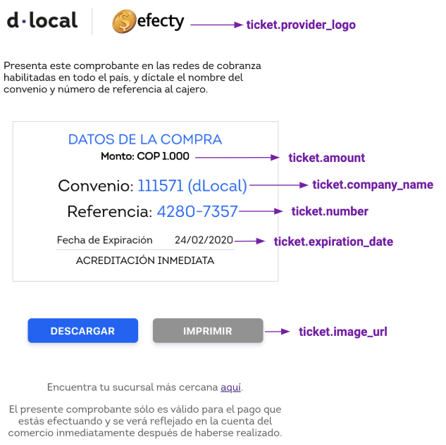

# Colombia

### Payment Methods Available


<table>
  <thead>
    <tr>
      <th style="text-align:left"><code>payment_<br />method_id</code>
      </th>
      <th style="text-align:left"><b>Name</b>
      </th>
      <th style="text-align:left"><code>payment_<br />method_type</code>
      </th>
      <th style="text-align:left"><code>brand</code>
      </th>
      <th style="text-align:left"><b>Details</b>
      </th>
      <th style="text-align:left">Allowed Flows</th>
      <th style="text-align:left"><b>Logo</b>
      </th>
    </tr>
  </thead>
  <tbody>
    <tr>
      <td style="text-align:left"><code>EY</code>
      </td>
      <td style="text-align:left">Efecty</td>
      <td style="text-align:left"><code>TICKET</code>
      </td>
      <td style="text-align:left"></td>
      <td style="text-align:left">Cash Payment</td>
      <td style="text-align:left"><code>REDIRECT</code>
      </td>
      <td style="text-align:left">&#x200B;<a href="https://pay.dlocal.com/views/2.0/images/payments/EY.png">https://pay.dlocal.com/views/2.0/images/payments/EY.png</a>&#x200B;</td>
    </tr>
    <tr>
      <td style="text-align:left"><code>DA</code>
      </td>
      <td style="text-align:left">Davivienda</td>
      <td style="text-align:left"><code>TICKET</code>
      </td>
      <td style="text-align:left"></td>
      <td style="text-align:left">Cash Payment</td>
      <td style="text-align:left"><code>REDIRECT</code>
      </td>
      <td style="text-align:left">&#x200B;<a href="https://pay.dlocal.com/views/2.0/images/payments/DA.png">https://pay.dlocal.com/views/2.0/images/payments/DA.png</a>&#x200B;</td>
    </tr>
    <tr>
      <td style="text-align:left"><code>PC</code>
      </td>
      <td style="text-align:left">PSE</td>
      <td style="text-align:left"><code>BANK_TRANSFER</code>
      </td>
      <td style="text-align:left"></td>
      <td style="text-align:left">Bank Transfer Online</td>
      <td style="text-align:left"><code>REDIRECT</code>
      </td>
      <td style="text-align:left">&#x200B;<a href="https://pay.dlocal.com/views/2.0/images/payments/PC.png">https://pay.dlocal.com/views/2.0/images/payments/PC.png</a>&#x200B;</td>
    </tr>
    <tr>
      <td style="text-align:left"><code>BU</code>
      </td>
      <td style="text-align:left">Baloto</td>
      <td style="text-align:left"><code>TICKET</code>
      </td>
      <td style="text-align:left"></td>
      <td style="text-align:left">Cash Payment</td>
      <td style="text-align:left"><code>REDIRECT</code>
      </td>
      <td style="text-align:left">&#x200B;<a href="https://pay.dlocal.com/views/2.0/images/payments/BU.png">https://pay.dlocal.com/views/2.0/images/payments/BU.png</a>&#x200B;</td>
    </tr>
    <tr>
      <td style="text-align:left"><code>CARD</code>
      </td>
      <td style="text-align:left">Visa</td>
      <td style="text-align:left"><code>CARD</code>
      </td>
      <td style="text-align:left"><code>VI</code>
      </td>
      <td style="text-align:left">Credit Card</td>
      <td style="text-align:left">
        <p><code>DIRECT</code>
        </p>
        <p><code>REDIRECT</code>
        </p>
      </td>
      <td style="text-align:left">&#x200B;<a href="https://pay.dlocal.com/views/2.0/images/payments/VI.png">https://pay.dlocal.com/views/2.0/images/payments/VI.png</a>&#x200B;</td>
    </tr>
    <tr>
      <td style="text-align:left"><code>CARD</code>
      </td>
      <td style="text-align:left">MasterCard</td>
      <td style="text-align:left"><code>CARD</code>
      </td>
      <td style="text-align:left"><code>MC</code>
      </td>
      <td style="text-align:left">Credit Card</td>
      <td style="text-align:left">
        <p><code>DIRECT</code>
        </p>
        <p><code>REDIRECT</code>
        </p>
      </td>
      <td style="text-align:left">&#x200B;<a href="https://pay.dlocal.com/views/2.0/images/payments/MC.png">https://pay.dlocal.com/views/2.0/images/payments/MC.png</a>&#x200B;</td>
    </tr>
    <tr>
      <td style="text-align:left"><code>CARD</code>
      </td>
      <td style="text-align:left">Visa Debit</td>
      <td style="text-align:left"><code>CARD</code>
      </td>
      <td style="text-align:left"><code>VD</code>
      </td>
      <td style="text-align:left">Debit Card</td>
      <td style="text-align:left">
        <p><code>DIRECT</code>
        </p>
        <p><code>REDIRECT</code>
        </p>
      </td>
      <td style="text-align:left">&#x200B;<a href="https://pay.dlocal.com/views/2.0/images/payments/VD.png">https://pay.dlocal.com/views/2.0/images/payments/VD.png</a>&#x200B;</td>
    </tr>
    <tr>
      <td style="text-align:left"><code>CARD</code>
      </td>
      <td style="text-align:left">MasterCard Debit</td>
      <td style="text-align:left"><code>CARD</code>
      </td>
      <td style="text-align:left"><code>MD</code>
      </td>
      <td style="text-align:left">Debit Card</td>
      <td style="text-align:left">
        <p><code>DIRECT</code>
        </p>
        <p><code>REDIRECT</code>
        </p>
      </td>
      <td style="text-align:left">&#x200B;<a href="https://pay.dlocal.com/views/2.0/images/payments/MD.png">https://pay.dlocal.com/views/2.0/images/payments/MD.png</a>&#x200B;</td>
    </tr>
    <tr>
      <td style="text-align:left"><code>CARD</code>
      </td>
      <td style="text-align:left">Amex</td>
      <td style="text-align:left"><code>CARD</code>
      </td>
      <td style="text-align:left"><code>AE</code>
      </td>
      <td style="text-align:left">Credit Card</td>
      <td style="text-align:left">
        <p><code>DIRECT</code>
        </p>
        <p><code>REDIRECT</code>
        </p>
      </td>
      <td style="text-align:left">&#x200B;<a href="https://pay.dlocal.com/views/2.0/images/payments/AE.png">https://pay.dlocal.com/views/2.0/images/payments/AE.png</a>&#x200B;</td>
    </tr>
    <tr>
      <td style="text-align:left"><code>CARD</code>
      </td>
      <td style="text-align:left">Diners</td>
      <td style="text-align:left"><code>CARD</code>
      </td>
      <td style="text-align:left"><code>DC</code>
      </td>
      <td style="text-align:left">Credit Card</td>
      <td style="text-align:left">
        <p><code>DIRECT</code>
        </p>
        <p><code>REDIRECT</code>
        </p>
      </td>
      <td style="text-align:left">&#x200B;<a href="https://pay.dlocal.com/views/2.0/images/payments/DC.png">https://pay.dlocal.com/views/2.0/images/payments/DC.png</a>&#x200B;</td>
    </tr>
    <tr>
      <td style="text-align:left"><code>PC</code>
      </td>
      <td style="text-align:left">Banco Agrario</td>
      <td style="text-align:left"><code>BANK_TRANSFER</code>
      </td>
      <td style="text-align:left"></td>
      <td style="text-align:left">Bank Transfer Online</td>
      <td style="text-align:left"><code>REDIRECT</code>
      </td>
      <td style="text-align:left">&#x200B;<a href="https://pay.dlocal.com/views/2.0/images/payments/PC.png">https://pay.dlocal.com/views/2.0/images/payments/PC.png</a>&#x200B;</td>
    </tr>
    <tr>
      <td style="text-align:left"><code>PC</code>
      </td>
      <td style="text-align:left">Banco Av Villas</td>
      <td style="text-align:left"><code>BANK_TRANSFER</code>
      </td>
      <td style="text-align:left"></td>
      <td style="text-align:left">Bank Transfer Online</td>
      <td style="text-align:left"><code>REDIRECT</code>
      </td>
      <td style="text-align:left">&#x200B;<a href="https://pay.dlocal.com/views/2.0/images/payments/PC.png">https://pay.dlocal.com/views/2.0/images/payments/PC.png</a>&#x200B;</td>
    </tr>
    <tr>
      <td style="text-align:left"><code>PC</code>
      </td>
      <td style="text-align:left">Banco Caja Social</td>
      <td style="text-align:left"><code>BANK_TRANSFER</code>
      </td>
      <td style="text-align:left"></td>
      <td style="text-align:left">Bank Transfer Online</td>
      <td style="text-align:left"><code>REDIRECT</code>
      </td>
      <td style="text-align:left">&#x200B;<a href="https://pay.dlocal.com/views/2.0/images/payments/PC.png">https://pay.dlocal.com/views/2.0/images/payments/PC.png</a>&#x200B;</td>
    </tr>
    <tr>
      <td style="text-align:left"><code>PC</code>
      </td>
      <td style="text-align:left">Banco Colpatria</td>
      <td style="text-align:left"><code>BANK_TRANSFER</code>
      </td>
      <td style="text-align:left"></td>
      <td style="text-align:left">Bank Transfer Online</td>
      <td style="text-align:left"><code>REDIRECT</code>
      </td>
      <td style="text-align:left">&#x200B;<a href="https://pay.dlocal.com/views/2.0/images/payments/PC.png">https://pay.dlocal.com/views/2.0/images/payments/PC.png</a>&#x200B;</td>
    </tr>
    <tr>
      <td style="text-align:left"><code>PC</code>
      </td>
      <td style="text-align:left">Banco Corpbanca S.A.</td>
      <td style="text-align:left"><code>BANK_TRANSFER</code>
      </td>
      <td style="text-align:left"></td>
      <td style="text-align:left">Bank Transfer Online</td>
      <td style="text-align:left"><code>REDIRECT</code>
      </td>
      <td style="text-align:left">&#x200B;<a href="https://pay.dlocal.com/views/2.0/images/payments/PC.png">https://pay.dlocal.com/views/2.0/images/payments/PC.png</a>&#x200B;</td>
    </tr>
    <tr>
      <td style="text-align:left"><code>PC</code>
      </td>
      <td style="text-align:left">Banco de Bogota</td>
      <td style="text-align:left"><code>BANK_TRANSFER</code>
      </td>
      <td style="text-align:left"></td>
      <td style="text-align:left">Bank Transfer Online</td>
      <td style="text-align:left"><code>REDIRECT</code>
      </td>
      <td style="text-align:left">&#x200B;<a href="https://pay.dlocal.com/views/2.0/images/payments/PC.png">https://pay.dlocal.com/views/2.0/images/payments/PC.png</a>&#x200B;</td>
    </tr>
    <tr>
      <td style="text-align:left"><code>PC</code>
      </td>
      <td style="text-align:left">Banco de Occidente</td>
      <td style="text-align:left"><code>BANK_TRANSFER</code>
      </td>
      <td style="text-align:left"></td>
      <td style="text-align:left">Bank Transfer Online</td>
      <td style="text-align:left"><code>REDIRECT</code>
      </td>
      <td style="text-align:left">&#x200B;<a href="https://pay.dlocal.com/views/2.0/images/payments/PC.png">https://pay.dlocal.com/views/2.0/images/payments/PC.png</a>&#x200B;</td>
    </tr>
    <tr>
      <td style="text-align:left"><code>PC</code>
      </td>
      <td style="text-align:left">Banco GNB Sudameris</td>
      <td style="text-align:left"><code>BANK_TRANSFER</code>
      </td>
      <td style="text-align:left"></td>
      <td style="text-align:left">Bank Transfer Online</td>
      <td style="text-align:left"><code>REDIRECT</code>
      </td>
      <td style="text-align:left">&#x200B;<a href="https://pay.dlocal.com/views/2.0/images/payments/PC.png">https://pay.dlocal.com/views/2.0/images/payments/PC.png</a>&#x200B;</td>
    </tr>
    <tr>
      <td style="text-align:left"><code>PC</code>
      </td>
      <td style="text-align:left">Banco Pichincha S.A.</td>
      <td style="text-align:left"><code>BANK_TRANSFER</code>
      </td>
      <td style="text-align:left"></td>
      <td style="text-align:left">Bank Transfer Online</td>
      <td style="text-align:left"><code>REDIRECT</code>
      </td>
      <td style="text-align:left">&#x200B;<a href="https://pay.dlocal.com/views/2.0/images/payments/PC.png">https://pay.dlocal.com/views/2.0/images/payments/PC.png</a>&#x200B;</td>
    </tr>
    <tr>
      <td style="text-align:left"><code>PC</code>
      </td>
      <td style="text-align:left">Banco Popular</td>
      <td style="text-align:left"><code>BANK_TRANSFER</code>
      </td>
      <td style="text-align:left"></td>
      <td style="text-align:left">Bank Transfer Online</td>
      <td style="text-align:left"><code>REDIRECT</code>
      </td>
      <td style="text-align:left">&#x200B;<a href="https://pay.dlocal.com/views/2.0/images/payments/PC.png">https://pay.dlocal.com/views/2.0/images/payments/PC.png</a>&#x200B;</td>
    </tr>
    <tr>
      <td style="text-align:left"><code>PC</code>
      </td>
      <td style="text-align:left">Banco Procredit</td>
      <td style="text-align:left"><code>BANK_TRANSFER</code>
      </td>
      <td style="text-align:left"></td>
      <td style="text-align:left">Bank Transfer Online</td>
      <td style="text-align:left"><code>REDIRECT</code>
      </td>
      <td style="text-align:left">&#x200B;<a href="https://pay.dlocal.com/views/2.0/images/payments/PC.png">https://pay.dlocal.com/views/2.0/images/payments/PC.png</a>&#x200B;</td>
    </tr>
    <tr>
      <td style="text-align:left"><code>PC</code>
      </td>
      <td style="text-align:left">Bancolombia</td>
      <td style="text-align:left"><code>BANK_TRANSFER</code>
      </td>
      <td style="text-align:left"></td>
      <td style="text-align:left">Bank Transfer Online</td>
      <td style="text-align:left"><code>REDIRECT</code>
      </td>
      <td style="text-align:left">&#x200B;<a href="https://pay.dlocal.com/views/2.0/images/payments/PC.png">https://pay.dlocal.com/views/2.0/images/payments/PC.png</a>&#x200B;</td>
    </tr>
    <tr>
      <td style="text-align:left"><code>PC</code>
      </td>
      <td style="text-align:left">Bancoomeva S.A.</td>
      <td style="text-align:left"><code>BANK_TRANSFER</code>
      </td>
      <td style="text-align:left"></td>
      <td style="text-align:left">Bank Transfer Online</td>
      <td style="text-align:left"><code>REDIRECT</code>
      </td>
      <td style="text-align:left">&#x200B;<a href="https://pay.dlocal.com/views/2.0/images/payments/PC.png">https://pay.dlocal.com/views/2.0/images/payments/PC.png</a>&#x200B;</td>
    </tr>
    <tr>
      <td style="text-align:left"><code>PC</code>
      </td>
      <td style="text-align:left">BBVA Colombia S.A.</td>
      <td style="text-align:left"><code>BANK_TRANSFER</code>
      </td>
      <td style="text-align:left"></td>
      <td style="text-align:left">Bank Transfer Online</td>
      <td style="text-align:left"><code>REDIRECT</code>
      </td>
      <td style="text-align:left">&#x200B;<a href="https://pay.dlocal.com/views/2.0/images/payments/PC.png">https://pay.dlocal.com/views/2.0/images/payments/PC.png</a>&#x200B;</td>
    </tr>
    <tr>
      <td style="text-align:left"><code>PC</code>
      </td>
      <td style="text-align:left">Citibank</td>
      <td style="text-align:left"><code>BANK_TRANSFER</code>
      </td>
      <td style="text-align:left"></td>
      <td style="text-align:left">Bank Transfer Online</td>
      <td style="text-align:left"><code>REDIRECT</code>
      </td>
      <td style="text-align:left">&#x200B;<a href="https://pay.dlocal.com/views/2.0/images/payments/PC.png">https://pay.dlocal.com/views/2.0/images/payments/PC.png</a>&#x200B;</td>
    </tr>
    <tr>
      <td style="text-align:left"><code>PC</code>
      </td>
      <td style="text-align:left">Helm Bank S.A.</td>
      <td style="text-align:left"><code>BANK_TRANSFER</code>
      </td>
      <td style="text-align:left"></td>
      <td style="text-align:left">Bank Transfer Online</td>
      <td style="text-align:left"><code>REDIRECT</code>
      </td>
      <td style="text-align:left">&#x200B;<a href="https://pay.dlocal.com/views/2.0/images/payments/PC.png">https://pay.dlocal.com/views/2.0/images/payments/PC.png</a>&#x200B;</td>
    </tr>
    <tr>
      <td style="text-align:left"><code>PC</code>
      </td>
      <td style="text-align:left">Banco Falabella</td>
      <td style="text-align:left"><code>BANK_TRANSFER</code>
      </td>
      <td style="text-align:left"></td>
      <td style="text-align:left">Bank Transfer Online</td>
      <td style="text-align:left"><code>REDIRECT</code>
      </td>
      <td style="text-align:left"></td>
    </tr>
  </tbody>
</table>## Direct Alternative Payment Methods

### Efecty

#### Example



#### Example Request

```bash
curl -X POST \
    -H 'X-Date: 2018-02-20T15:44:42.310Z' \
    -H 'X-Login: sak223k2wdksdl2' \
    -H 'X-Trans-Key: fm12O7G9' \
    -H 'Content-Type: application/json' \
    -H 'X-Version: 2.1' \
    -H 'Authorization: V2-HMAC-SHA256, Signature: 1bd227f9d892a7f4581b998c21e353b1686a6bdad5940e7bb6aa596c96e0a6ec' \
    -d '{body}'
    https://api.dlocal.com/payments
```

#### Example Request Body

```c
{
"amount": 10000,
"currency": "COP",
"country": "CO",
"payment_method_id": "EY",
"payment_method_flow": "DIRECT",
"payer": {
      "name": "Pedro Gomez",
      "email": "pedrogomez@dlocal.com",
      "document": "297332162"
},
"order_id": "jhg4v34v224",
"notification_url": "http://merchant.com/notification/new"
}
```



#### Example Response

```c
{
    "id": "D-4-7451e7ba-607c-4465-bddb-3f8064b1286a",
    "amount": 10000,
    "currency": "COP",
    "payment_method_id": "EY",
    "payment_method_type": "TICKET",
    "payment_method_flow": "DIRECT",
    "country": "CO",
    "ticket": {
        "type": "CUSTOM",
        "format": "Code 128",
        "number": "42807357",
        "expiration_date": "2020-02-24T02:59:00.000+0000",
        "barcode": "41577099989921778020000042807357390020200223",
        "company_name": "Dlocal",
        "provider_name": "efecty",
        "provider_logo": "https://static-dlocal.s3-eu-west-1.amazonaws.com/images/providers/efecty.png",
        "image_url": "https://pay.dlocal.com/gmf/payments/M-6c7e70b0-5292-11ea-abfe-fd29dfbcaf58",
        "amount": 10000,
        "currency": "COP"
    },
    "created_date": "2020-02-18T21:05:42.000+0000",
    "status": "PENDING",
    "status_detail": "The payment is pending.",
    "status_code": "100",
    "order_id": "a6cc9725-86e5-46c5-a79c-7d874b80cff6",
    "notification_url": "http://conductor.sandbox.internal/robot-server/rest/generic/notification/new"
}
```






**User Interface Tips:**

* Separate the **ticket.number** this way: 4 digits - 4 digits. It is easier for users to dictate it to cashiers.
* It is important that you add this text _**Convenio: 111571 \(&lt;ticket.company\_name&gt;\)**_. This identifies the payment beneficiary and many times helps cashiers to find the payment on their system.
* **Currency** and **amount** should be relevant elements in the ticket. Users need to be aware of that at all times.
* Make sure that the **expiration date** is clear and visible enough. In Colombia people use the **dd/mm/yyyy** format.
* Make it clear for the user that their payment will be **credited immediately**. This brings confidence and a sense of security that helps conversion rates.
* Include **payment instructions**. Although most users are familiarized with Efecty payment method, it is a good practice to help those who are not used to it. In the image above there is an example of instructions, but if needed, our team will be happy to help you with more personalized instructions.
* A **Store locator** is a helpful feature. Just link it to [google.com/maps/search/efecty/](https://www.google.com/maps/search/efecty)
* A **Save button** helps users to have their ticket always on their phone, making it needless to take notes or keep the browser opened.
* A **Print button** is useful for some users that need to have their tickets printed.


