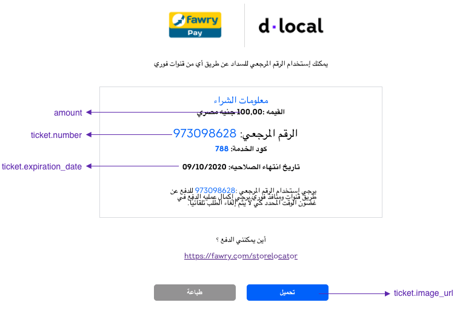

# Egypt

## Payment Methods Available 

<table>
  <thead>
    <tr>
      <th style="text-align:left"><code>payment_<br />method_id</code>
      </th>
      <th style="text-align:left"><b>Name</b>
      </th>
      <th style="text-align:left"><code>payment_</code>
        <br /><code>method_type</code>
      </th>
      <th style="text-align:left"><code>brand</code>
      </th>
      <th style="text-align:left"><b>Details</b>
      </th>
      <th style="text-align:left">Allowed Flows</th>
      <th style="text-align:left"><b>Logos</b>
      </th>
    </tr>
  </thead>
  <tbody>
    <tr>
      <td style="text-align:left"><code>CARD</code>
      </td>
      <td style="text-align:left">Visa</td>
      <td style="text-align:left"><code>CARD</code>
      </td>
      <td style="text-align:left"><code>VI</code>
      </td>
      <td style="text-align:left">Credit Card</td>
      <td style="text-align:left">
        <p><code>DIRECT</code>
        </p>
        <p><code>REDIRECT</code>
        </p>
      </td>
      <td style="text-align:left">&#x200B;<a href="https://static.dlocal.com/images/providers/Visa_logo.png">https://pay.dlocal.com/views/2.0/images/payments/VI.png</a>&#x200B;</td>
    </tr>
    <tr>
      <td style="text-align:left"><code>CARD</code>
      </td>
      <td style="text-align:left">Visa Debit</td>
      <td style="text-align:left"><code>CARD</code>
      </td>
      <td style="text-align:left"><code>VD</code>
      </td>
      <td style="text-align:left">Debit Card</td>
      <td style="text-align:left">
        <p><code>DIRECT</code>
        </p>
        <p><code>REDIRECT</code>
        </p>
      </td>
      <td style="text-align:left"><a href="https://pay.dlocal.com/views/2.0/images/payments/VD.png">https://pay.dlocal.com/views/2.0/images/payments/VD.png</a>
      </td>
    </tr>
    <tr>
      <td style="text-align:left"><code>CARD</code>
      </td>
      <td style="text-align:left">Mastercard</td>
      <td style="text-align:left"><code>CARD</code>
      </td>
      <td style="text-align:left"><code>MC</code>
      </td>
      <td style="text-align:left">Credit Card</td>
      <td style="text-align:left">
        <p><code>DIRECT</code>
        </p>
        <p><code>REDIRECT</code>
        </p>
      </td>
      <td style="text-align:left"><a href="https://static.dlocal.com/images/providers/master.png">&#x200B;https://pay.dlocal.com/views/2.0/images/payments/MC.png</a>
      </td>
    </tr>
    <tr>
      <td style="text-align:left"><code>CARD</code>
      </td>
      <td style="text-align:left">Mastercard Debit</td>
      <td style="text-align:left"><code>CARD</code>
      </td>
      <td style="text-align:left"><code>MD</code>
      </td>
      <td style="text-align:left">Debit Card</td>
      <td style="text-align:left">
        <p><code>DIRECT</code>
        </p>
        <p><code>REDIRECT</code>
        </p>
      </td>
      <td style="text-align:left"><a href="https://pay.dlocal.com/views/2.0/images/payments/MD.png">https://pay.dlocal.com/views/2.0/images/payments/MD.png</a>
      </td>
    </tr>
    <tr>
      <td style="text-align:left"><code>FW</code>
      </td>
      <td style="text-align:left">Fawry</td>
      <td style="text-align:left"><code>TICKET</code>
      </td>
      <td style="text-align:left"></td>
      <td style="text-align:left">Cash</td>
      <td style="text-align:left">
        <p><code>DIRECT</code>
        </p>
        <p><code>REDIRECT</code>
        </p>
      </td>
      <td style="text-align:left"><a href="https://static.dlocal.com/images/providers/fawry.png">https://static.dlocal.com/images/providers/fawry.png</a>
      </td>
    </tr>
    <tr>
      <td style="text-align:left"><code>ME</code>
      </td>
      <td style="text-align:left">Meeza</td>
      <td style="text-align:left"><code>CARD</code>
      </td>
      <td style="text-align:left"></td>
      <td style="text-align:left">
        <p>Debit</p>
        <p>Card</p>
      </td>
      <td style="text-align:left">
        <p><code>DIRECT</code>
        </p>
        <p><code>REDIRECT</code>
        </p>
      </td>
      <td style="text-align:left"></td>
    </tr>
  </tbody>
</table>


## Direct Alternative Payment Methods

### Fawry

#### Example



#### Example Request

```bash
curl -X POST \
    -H 'X-Date: 2018-02-20T15:44:42.310Z' \
    -H 'X-Login: sak223k2wdksdl2' \
    -H 'X-Trans-Key: fm12O7G9' \
    -H 'Content-Type: application/json' \
    -H 'X-Version: 2.1' \
    -H 'Authorization: V2-HMAC-SHA256, Signature: 1bd227f9d892a7f4581b998c21e353b1686a6bdad5940e7bb6aa596c96e0a6ec' \
    -d '{body}'
    https://api.dlocal.com/payments
```

#### Example Request Body

```c
{
    "amount": 100,
    "currency": "EGP",
    "country": "EG",
    "payment_method_id": "FW",
    "payment_method_flow": "DIRECT",
    "payer": {
        "name": "Amir Mazeh",
        "email": "test@dlocal.com",
        "phone": "4832696773",
        "document": "12342412",
    },
    "order_id": "jv34281ny5",
    "description": "test",
    "notification_url": "http://conductor.sandbox.internal/robot-server/rest/generic/notification/new"
}
```



#### Example Response

```c
{
    "id": "D-4-86dc111f-bc39-4df6-bb16-06a2e528b715",
    "amount": 100,
    "currency": "EGP",
    "payment_method_id": "FW",
    "payment_method_type": "TICKET",
    "payment_method_flow": "DIRECT",
    "country": "EG",
    "bank_transfer": {},
    "ticket": {
        "type": "REFERENCE_CODE",
        "number": "973098628",
        "expiration_date": "2020-10-09T21:59:00.000+0000",
        "image_url": "https://pay.dlocal.com/gmf/payments/M-c4418cdb-4526-4eea-9edc-33c54469b848",
        "amount": 100,
        "currency": "EGP"
    },
    "created_date": "2020-10-02T18:59:41.000+0000",
    "status": "PENDING",
    "status_detail": "The payment is pending.",
    "status_code": "100",
    "order_id": "808a6614-ac5e-4f78-ab24-a9f34b2054d6",
    "notification_url": "http://conductor.sandbox.internal/robot-server/rest/generic/notification/new"
}
```






**User Interface Tips:**

* When user phone is included in the API request, an SMS with basic payment information is sent to the user. It is **strongly recommended to ask and send user phone**, since it help users to make the payment, increasing conversion rates.
* It is important that you add this text **كود الخدمة: 788 \(Service code: 788\).** This identifies the payment beneficiary and many times helps cashiers to find the payment ****on their system
* **Currency** and **amount** should be relevant elements in the ticket. Users need to be aware of that at all times.
* Make sure that the **expiration date** is clear and visible enough. In Egypt people use the **dd/mm/yyyy** format.
* Include **payment instructions**. Although most users are familiarized with Fawry payment method, it is a good practice to help those who are not used to it. In the image above there is an example of instructions, but if needed, our team will be happy to help you with more personalized instructions.
* A **Store locator** is a helpful feature. Just link it to [https://fawry.com/storelocator](https://fawry.com/storelocator)
* A **Save button** help users to have their ticket always on their phone, making it needless to take notes or keep the browser opened.
* A **Print button** is useful for some users that need to have their tickets printed.



