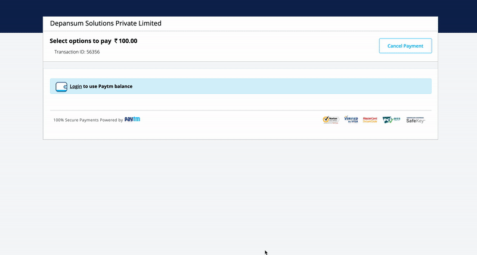

# India

### Payment Methods Available

<table>
  <thead>
    <tr>
      <th style="text-align:left"><code>payment_<br />method_id</code>
      </th>
      <th style="text-align:left"><b>Name</b>
      </th>
      <th style="text-align:left"><code>payment_</code>
        <br /><code>method_type</code>
      </th>
      <th style="text-align:left"><code>brand</code>
      </th>
      <th style="text-align:left"><b>Details</b>
      </th>
      <th style="text-align:left">Allowed Flows</th>
      <th style="text-align:left"><b>Logo</b>
      </th>
    </tr>
  </thead>
  <tbody>
    <tr>
      <td style="text-align:left"><code>CARD</code>
      </td>
      <td style="text-align:left">Visa</td>
      <td style="text-align:left"><code>CARD</code>
      </td>
      <td style="text-align:left"><code>VI</code>
      </td>
      <td style="text-align:left">Credit Card</td>
      <td style="text-align:left">
        <p><code>DIRECT</code>
        </p>
        <p><code>REDIRECT</code>
        </p>
      </td>
      <td style="text-align:left">&#x200B;<a href="https://pay.dlocal.com/views/2.0/images/payments/VI.png">https://pay.dlocal.com/views/2.0/images/payments/VI.png</a>&#x200B;</td>
    </tr>
    <tr>
      <td style="text-align:left"><code>CARD</code>
      </td>
      <td style="text-align:left">Visa Debit</td>
      <td style="text-align:left"><code>CARD</code>
      </td>
      <td style="text-align:left"><code>VD</code>
      </td>
      <td style="text-align:left">Debit Card</td>
      <td style="text-align:left">
        <p><code>DIRECT</code>
        </p>
        <p><code>REDIRECT</code>
        </p>
      </td>
      <td style="text-align:left"><a href="      https://pay.dlocal.com/views/2.0/images/payments/VD.png&#x200B;">https://pay.dlocal.com/views/2.0/images/payments/VD.png&#x200B;</a>
      </td>
    </tr>
    <tr>
      <td style="text-align:left"><code>CARD</code>
      </td>
      <td style="text-align:left">MasterCard</td>
      <td style="text-align:left"><code>CARD</code>
      </td>
      <td style="text-align:left"><code>MC</code>
      </td>
      <td style="text-align:left">Credit Card</td>
      <td style="text-align:left">
        <p><code>DIRECT</code>
        </p>
        <p><code>REDIRECT</code>
        </p>
      </td>
      <td style="text-align:left">&#x200B;<a href="https://pay.dlocal.com/views/2.0/images/payments/MC.png">https://pay.dlocal.com/views/2.0/images/payments/MC.png</a>&#x200B;</td>
    </tr>
    <tr>
      <td style="text-align:left"><code>CARD</code>
      </td>
      <td style="text-align:left">MasterCard Debit</td>
      <td style="text-align:left"><code>CARD</code>
      </td>
      <td style="text-align:left"><code>MD</code>
      </td>
      <td style="text-align:left">Debit Card</td>
      <td style="text-align:left">
        <p><code>DIRECT</code>
        </p>
        <p><code>REDIRECT</code>
        </p>
      </td>
      <td style="text-align:left">&#x200B;<a href="https://pay.dlocal.com/views/2.0/images/payments/MD.png&#x200B;">https://pay.dlocal.com/views/2.0/images/payments/MD.png&#x200B;</a>
      </td>
    </tr>
    <tr>
      <td style="text-align:left"><code>CARD</code>
      </td>
      <td style="text-align:left">American Express</td>
      <td style="text-align:left"><code>CARD</code>
      </td>
      <td style="text-align:left"><code>AE</code>
      </td>
      <td style="text-align:left">Credit Card</td>
      <td style="text-align:left">
        <p><code>DIRECT</code>
        </p>
        <p><code>REDIRECT</code>
        </p>
      </td>
      <td style="text-align:left">&#x200B;<a href="https://pay.dlocal.com/views/2.0/images/payments/AE.png">https://pay.dlocal.com/views/2.0/images/payments/AE.png</a>&#x200B;</td>
    </tr>
    <tr>
      <td style="text-align:left"><code>CARD</code>
      </td>
      <td style="text-align:left">Diners</td>
      <td style="text-align:left"><code>CARD</code>
      </td>
      <td style="text-align:left"><code>DC</code>
      </td>
      <td style="text-align:left">Credit Card</td>
      <td style="text-align:left">
        <p><code>DIRECT</code>
        </p>
        <p><code>REDIRECT</code>
        </p>
      </td>
      <td style="text-align:left"><a href="https://pay.dlocal.com/views/2.0/images/payments/DC.png">https://pay.dlocal.com/views/2.0/images/payments/DC.png</a>
      </td>
    </tr>
    <tr>
      <td style="text-align:left"><code>CARD</code>
      </td>
      <td style="text-align:left">Mestro Debit</td>
      <td style="text-align:left"><code>CARD</code>
      </td>
      <td style="text-align:left"><code>MS</code>
      </td>
      <td style="text-align:left">Debit Card</td>
      <td style="text-align:left">
        <p><code>DIRECT</code>
        </p>
        <p><code>REDIRECT</code>
        </p>
      </td>
      <td style="text-align:left"><a href="https://pay.dlocal.com/views/2.0/images/payments/MS.png">https://pay.dlocal.com/views/2.0/images/payments/MS.png</a>
      </td>
    </tr>
    <tr>
      <td style="text-align:left"><code>CARD</code>
      </td>
      <td style="text-align:left">RuPay</td>
      <td style="text-align:left"><code>CARD</code>
      </td>
      <td style="text-align:left"><code>RU</code>
      </td>
      <td style="text-align:left">Credit / Debit Card</td>
      <td style="text-align:left">
        <p><code>DIRECT</code>
        </p>
        <p><code>REDIRECT</code>
        </p>
      </td>
      <td style="text-align:left">&#x200B;<a href="https://pay.dlocal.com/views/2.0/images/payments/RU.png">https://pay.dlocal.com/views/2.0/images/payments/RU.png</a>
      </td>
    </tr>
    <tr>
      <td style="text-align:left"><code>PW</code>
      </td>
      <td style="text-align:left">PayTM Wallet</td>
      <td style="text-align:left"><code>BANK_TRANSFER</code>
      </td>
      <td style="text-align:left"></td>
      <td style="text-align:left">Wallet</td>
      <td style="text-align:left"><code>REDIRECT</code>
      </td>
      <td style="text-align:left"><a href="https://pay.dlocal.com/views/2.0/images/payments/PW.png">&#x200B;https://pay.dlocal.com/views/2.0/images/payments/PW.png&#x200B;</a>
      </td>
    </tr>
    <tr>
      <td style="text-align:left"><code>CW</code>
      </td>
      <td style="text-align:left">PhonePe</td>
      <td style="text-align:left"><code>BANK_TRANSFER</code>
      </td>
      <td style="text-align:left"></td>
      <td style="text-align:left">Wallet</td>
      <td style="text-align:left"><code>REDIRECT</code>
      </td>
      <td style="text-align:left"></td>
    </tr>
    <tr>
      <td style="text-align:left"><code>CW</code>
      </td>
      <td style="text-align:left">MobiKwik</td>
      <td style="text-align:left"><code>BANK_TRANSFER</code>
      </td>
      <td style="text-align:left"></td>
      <td style="text-align:left">Wallet</td>
      <td style="text-align:left"><code>REDIRECT</code>
      </td>
      <td style="text-align:left"></td>
    </tr>
    <tr>
      <td style="text-align:left"><code>CW</code>
      </td>
      <td style="text-align:left">Ola Money</td>
      <td style="text-align:left"><code>BANK_TRANSFER</code>
      </td>
      <td style="text-align:left"></td>
      <td style="text-align:left">Wallet</td>
      <td style="text-align:left"><code>REDIRECT</code>
      </td>
      <td style="text-align:left"></td>
    </tr>
    <tr>
      <td style="text-align:left"><code>CW</code>
      </td>
      <td style="text-align:left">airtel money</td>
      <td style="text-align:left"><code>BANK_TRANSFER</code>
      </td>
      <td style="text-align:left"></td>
      <td style="text-align:left">Wallet</td>
      <td style="text-align:left"><code>REDIRECT</code>
      </td>
      <td style="text-align:left"></td>
    </tr>
    <tr>
      <td style="text-align:left"><code>CW</code>
      </td>
      <td style="text-align:left">Jio Money</td>
      <td style="text-align:left"><code>BANK_TRANSFER</code>
      </td>
      <td style="text-align:left"></td>
      <td style="text-align:left">Wallet</td>
      <td style="text-align:left"><code>REDIRECT</code>
      </td>
      <td style="text-align:left"></td>
    </tr>
    <tr>
      <td style="text-align:left"><code>CW</code>
      </td>
      <td style="text-align:left">freecharge</td>
      <td style="text-align:left"><code>BANK_TRANSFER</code>
      </td>
      <td style="text-align:left"></td>
      <td style="text-align:left">Wallet</td>
      <td style="text-align:left"><code>REDIRECT</code>
      </td>
      <td style="text-align:left"></td>
    </tr>
    <tr>
      <td style="text-align:left"><code>NB</code>
      </td>
      <td style="text-align:left">Netbanking</td>
      <td style="text-align:left"><code>BANK_TRANSFER</code>
      </td>
      <td style="text-align:left"></td>
      <td style="text-align:left">Bank Transfer Online</td>
      <td style="text-align:left"><code>REDIRECT</code>
      </td>
      <td style="text-align:left">&#x200B;<a href="https://pay.dlocal.com/views/2.0/images/payments/NB.png">https://pay.dlocal.com/views/2.0/images/payments/NB.png</a>&#x200B;</td>
    </tr>
    <tr>
      <td style="text-align:left"><code>UI</code>
      </td>
      <td style="text-align:left">UPI</td>
      <td style="text-align:left"><code>BANK_TRANSFER</code>
      </td>
      <td style="text-align:left"></td>
      <td style="text-align:left">Bank Transfer Online</td>
      <td style="text-align:left"><code>REDIRECT</code>
      </td>
      <td style="text-align:left">&#x200B;<a href="https://pay.dlocal.com/views/2.0/images/payments/UI.png">https://pay.dlocal.com/views/2.0/images/payments/UI.png</a>&#x200B;</td>
    </tr>
    <tr>
      <td style="text-align:left"><code>II</code>
      </td>
      <td style="text-align:left">ICICI Bank</td>
      <td style="text-align:left"><code>BANK_TRANSFER</code>
      </td>
      <td style="text-align:left"></td>
      <td style="text-align:left">PayLater</td>
      <td style="text-align:left"><code>REDIRECT</code>
      </td>
      <td style="text-align:left"><a href="https://static.dlocal.com/images/providers/ICICIBANK.png">https://static.dlocal.com/images/providers/ICICIBANK.png</a>
      </td>
    </tr>
    <tr>
      <td style="text-align:left"><code>GS</code>
      </td>
      <td style="text-align:left">Getsimpl</td>
      <td style="text-align:left"><code>BANK_TRANSFER</code>
      </td>
      <td style="text-align:left"></td>
      <td style="text-align:left">PayLater</td>
      <td style="text-align:left"><code>REDIRECT</code>
      </td>
      <td style="text-align:left"><a href="https://static.dlocal.com/images/providers/Simpl.png">https://static.dlocal.com/images/providers/Simpl.png</a>
      </td>
    </tr>
    <tr>
      <td style="text-align:left"><code>PL</code>
      </td>
      <td style="text-align:left">epaylater</td>
      <td style="text-align:left"><code>BANK_TRANSFER</code>
      </td>
      <td style="text-align:left"></td>
      <td style="text-align:left">PayLater</td>
      <td style="text-align:left"><code>REDIRECT</code>
      </td>
      <td style="text-align:left"><a href="https://static.dlocal.com/images/providers/ePaylater.png">https://static.dlocal.com/images/providers/ePaylater.png</a>
      </td>
    </tr>
  </tbody>
</table>

## Redirect Alternative Payment Methods

### PayTM Wallet



#### Example Request

```bash
curl -X POST \
    -H 'X-Date: 2018-02-20T15:44:42.310Z' \
    -H 'X-Login: sak223k2wdksdl2' \
    -H 'X-Trans-Key: fm12O7G9' \
    -H 'Content-Type: application/json' \
    -H 'X-Version: 2.1' \
    -H 'Authorization: V2-HMAC-SHA256, Signature: 1bd227f9d892a7f4581b998c21e353b1686a6bdad5940e7bb6aa596c96e0a6ec' \
    -d '{body}'
    https://api.dlocal.com/payments
```

#### Example Request Body

```yaml
{
    "amount": 100,
    "currency": "INR",
    "country": "IN",
    "payment_method_id": "PW",
    "payment_method_flow": "REDIRECT",
    "payer": {
        "name": "Rajesh Koothrappali",
        "email": "rajesh@acme.com",
        "document": "EHFGA5967A",
        "document2": "37AADCB2230M2ZR",
        "address": {
            "city": "Goa",
            "street": "Maddo Vaddo",
            "number": "1207"
        }
    },
    "order_id": "jhg4v34v534",
    "notification_url": "http://conductor.sandbox.internal/robot-server/rest/generic/notification/new"
}
```



#### Example Response

```yaml
{
    "id": "D-4-1a64bdbd-faf5-473e-94b5-f96d36ef0d3f",
    "amount": 100,
    "currency": "INR",
    "payment_method_id": "PW",
    "payment_method_type": "BANK_TRANSFER",
    "payment_method_flow": "REDIRECT",
    "country": "IN",
    "created_date": "2018-12-21T17:06:49.545+0000",
    "status": "PENDING",
    "status_detail": "The payment is pending.",
    "status_code": "100",
    "order_id": "jhg4v34v534",
    "notification_url": "http://conductor.sandbox.internal/robot-server/rest/generic/notification/new",
    "redirect_url": "https://sandbox.dlocal.com/collect/pay/pay/M-a75286b0-5557-11e9-9f92-dbdad3ad0963?xtid=CATH-ST-1554217056-343949416"
}
```





