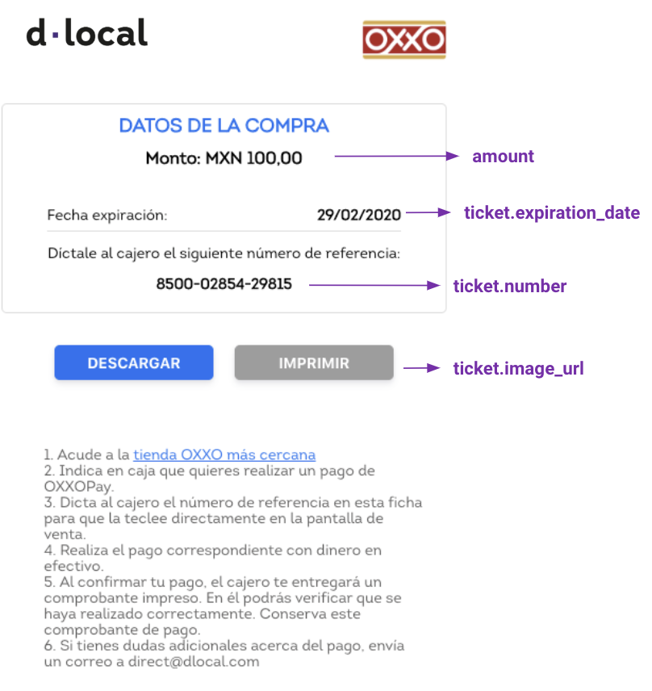
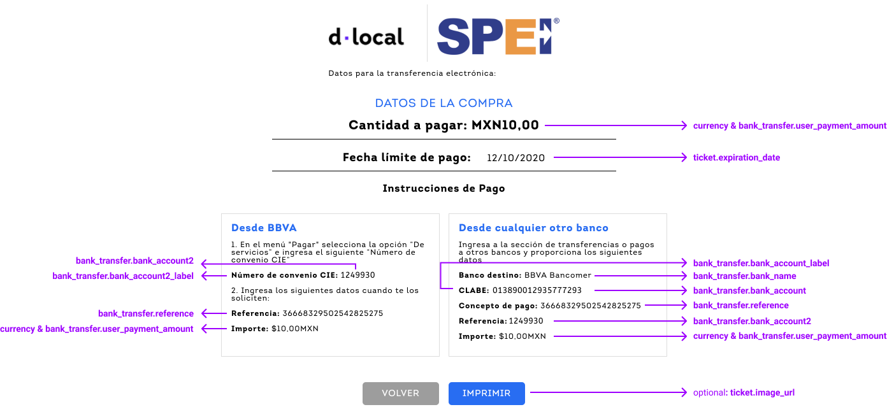

# Mexico

## Payment Methods Available

<table>
  <thead>
    <tr>
      <th style="text-align:left"><code>payment_method_id</code>
      </th>
      <th style="text-align:left"><b>Name</b>
      </th>
      <th style="text-align:left"><code>payment_method_type</code>
      </th>
      <th style="text-align:left"><code>brand</code>
      </th>
      <th style="text-align:left">Details</th>
      <th style="text-align:left">Allowed Flows</th>
      <th style="text-align:left"><b>Logo</b>
      </th>
    </tr>
  </thead>
  <tbody>
    <tr>
      <td style="text-align:left"><code>OX</code>
      </td>
      <td style="text-align:left">OXXO</td>
      <td style="text-align:left"><code>TICKET</code>
      </td>
      <td style="text-align:left"></td>
      <td style="text-align:left">Cash Payment</td>
      <td style="text-align:left"><code>REDIRECT</code>
      </td>
      <td style="text-align:left">&#x200B;<a href="https://pay.dlocal.com/views/2.0/images/payments/OX.png">https://pay.dlocal.com/views/2.0/images/payments/OX.png</a>&#x200B;</td>
    </tr>
    <tr>
      <td style="text-align:left"><code>SE</code>
      </td>
      <td style="text-align:left">SPEI</td>
      <td style="text-align:left"><code>BANK_TRANSFER</code>
      </td>
      <td style="text-align:left"></td>
      <td style="text-align:left">Bank Transfer Online</td>
      <td style="text-align:left">
        <p><code>DIRECT</code>
        </p>
        <p><code>REDIRECT</code>
        </p>
      </td>
      <td style="text-align:left">&#x200B;<a href="https://pay.dlocal.com/views/2.0/images/payments/SE.png">https://pay.dlocal.com/views/2.0/images/payments/SE.png</a>&#x200B;</td>
    </tr>
    <tr>
      <td style="text-align:left">IO</td>
      <td style="text-align:left">STP</td>
      <td style="text-align:left"><code>BANK_TRANSFER</code>
      </td>
      <td style="text-align:left"></td>
      <td style="text-align:left">Bank Transfer Online</td>
      <td style="text-align:left">
        <p><code>DIRECT</code>
        </p>
        <p><code>REDIRECT</code>
        </p>
      </td>
      <td style="text-align:left"><a href="https://pay.dlocal.com/views/2.0/images/payments/NB.png">https://pay.dlocal.com/views/2.0/images/payments/NB.png</a>&#x200B;</td>
    </tr>
    <tr>
      <td style="text-align:left"><code>BV</code>
      </td>
      <td style="text-align:left">BBVA Bancomer</td>
      <td style="text-align:left"><code>BANK_TRANSFER</code>
      </td>
      <td style="text-align:left"></td>
      <td style="text-align:left">Bank Transfer Online</td>
      <td style="text-align:left"><code>REDIRECT</code>
      </td>
      <td style="text-align:left">&#x200B;<a href="https://pay.dlocal.com/views/2.0/images/payments/BV.png">https://pay.dlocal.com/views/2.0/images/payments/BV.png</a>&#x200B;</td>
    </tr>
    <tr>
      <td style="text-align:left"><code>BQ</code>
      </td>
      <td style="text-align:left">Banorte</td>
      <td style="text-align:left"><code>BANK_TRANSFER</code>
      </td>
      <td style="text-align:left"></td>
      <td style="text-align:left">Bank Transfer Online</td>
      <td style="text-align:left"><code>REDIRECT</code>
      </td>
      <td style="text-align:left">&#x200B;<a href="https://pay.dlocal.com/views/2.0/images/payments/BN.png">https://pay.dlocal.com/views/2.0/images/payments/BN.png</a>&#x200B;</td>
    </tr>
    <tr>
      <td style="text-align:left"><code>SM</code>
      </td>
      <td style="text-align:left">Santander</td>
      <td style="text-align:left"><code>BANK_TRANSFER</code>
      </td>
      <td style="text-align:left"></td>
      <td style="text-align:left">Bank Transfer Online</td>
      <td style="text-align:left"><code>REDIRECT</code>
      </td>
      <td style="text-align:left">&#x200B;<a href="https://pay.dlocal.com/views/2.0/images/payments/SM.png">https://pay.dlocal.com/views/2.0/images/payments/SM.png</a>&#x200B;</td>
    </tr>
    <tr>
      <td style="text-align:left"><code>CARD</code>
      </td>
      <td style="text-align:left">Visa</td>
      <td style="text-align:left"><code>CARD</code>
      </td>
      <td style="text-align:left"><code>VI</code>
      </td>
      <td style="text-align:left">Credit Card</td>
      <td style="text-align:left">
        <p><code>DIRECT</code>
        </p>
        <p><code>REDIRECT</code>
        </p>
      </td>
      <td style="text-align:left">&#x200B;<a href="https://pay.dlocal.com/views/2.0/images/payments/VI.png">https://pay.dlocal.com/views/2.0/images/payments/VI.png</a>&#x200B;</td>
    </tr>
    <tr>
      <td style="text-align:left"><code>CARD</code>
      </td>
      <td style="text-align:left">MasterCard</td>
      <td style="text-align:left"><code>CARD</code>
      </td>
      <td style="text-align:left"><code>MC</code>
      </td>
      <td style="text-align:left">Credit Card</td>
      <td style="text-align:left">
        <p><code>DIRECT</code>
        </p>
        <p><code>REDIRECT</code>
        </p>
      </td>
      <td style="text-align:left">&#x200B;<a href="https://pay.dlocal.com/views/2.0/images/payments/MC.png">https://pay.dlocal.com/views/2.0/images/payments/MC.png</a>&#x200B;</td>
    </tr>
    <tr>
      <td style="text-align:left"><code>CARD</code>
      </td>
      <td style="text-align:left">Visa Debit</td>
      <td style="text-align:left"><code>CARD</code>
      </td>
      <td style="text-align:left"><code>VD</code>
      </td>
      <td style="text-align:left">Debit Card</td>
      <td style="text-align:left">
        <p><code>DIRECT</code>
        </p>
        <p><code>REDIRECT</code>
        </p>
      </td>
      <td style="text-align:left">&#x200B;<a href="https://pay.dlocal.com/views/2.0/images/payments/VD.png">https://pay.dlocal.com/views/2.0/images/payments/VD.png</a>&#x200B;</td>
    </tr>
    <tr>
      <td style="text-align:left"><code>CARD</code>
      </td>
      <td style="text-align:left">MasterCard Debit</td>
      <td style="text-align:left"><code>CARD</code>
      </td>
      <td style="text-align:left"><code>MD</code>
      </td>
      <td style="text-align:left">Debit Card</td>
      <td style="text-align:left">
        <p><code>DIRECT</code>
        </p>
        <p><code>REDIRECT</code>
        </p>
      </td>
      <td style="text-align:left">&#x200B;<a href="https://pay.dlocal.com/views/2.0/images/payments/MD.png">https://pay.dlocal.com/views/2.0/images/payments/MD.png</a>&#x200B;</td>
    </tr>
    <tr>
      <td style="text-align:left"><code>CARD</code>
      </td>
      <td style="text-align:left">American Express</td>
      <td style="text-align:left"><code>CARD</code>
      </td>
      <td style="text-align:left"><code>AE</code>
      </td>
      <td style="text-align:left">Credit Card</td>
      <td style="text-align:left">
        <p><code>DIRECT</code>
        </p>
        <p><code>REDIRECT</code>
        </p>
      </td>
      <td style="text-align:left">&#x200B;<a href="https://pay.dlocal.com/views/2.0/images/payments/AE.png">https://pay.dlocal.com/views/2.0/images/payments/AE.png</a>&#x200B;</td>
    </tr>
    <tr>
      <td style="text-align:left"><code>CARD</code>
      </td>
      <td style="text-align:left">Carnet Credit</td>
      <td style="text-align:left"><code>CARD</code>
      </td>
      <td style="text-align:left"><code>KC</code>
      </td>
      <td style="text-align:left">Credit Card</td>
      <td style="text-align:left">
        <p><code>DIRECT</code>
        </p>
        <p><code>REDIRECT</code>
        </p>
      </td>
      <td style="text-align:left"><a href="https://pay.dlocal.com/views/2.0/images/payments/KC.png">https://pay.dlocal.com/views/2.0/images/payments/KC.png</a>
      </td>
    </tr>
    <tr>
      <td style="text-align:left"><code>CARD</code>
      </td>
      <td style="text-align:left">Carnet Debit</td>
      <td style="text-align:left"><code>CARD</code>
      </td>
      <td style="text-align:left"><code>KD</code>
      </td>
      <td style="text-align:left">Debit Card</td>
      <td style="text-align:left">
        <p><code>DIRECT</code>
        </p>
        <p><code>REDIRECT</code>
        </p>
      </td>
      <td style="text-align:left"><a href="https://pay.dlocal.com/views/2.0/images/payments/KD.png">https://pay.dlocal.com/views/2.0/images/payments/KD.png</a>
      </td>
    </tr>
  </tbody>
</table>


## Direct Alternative Payment Methods

### OXXO

#### Example



#### Example Request

```bash
curl -X POST \
    -H 'X-Date: 2018-02-20T15:44:42.310Z' \
    -H 'X-Login: sak223k2wdksdl2' \
    -H 'X-Trans-Key: fm12O7G9' \
    -H 'Content-Type: application/json' \
    -H 'X-Version: 2.1' \
    -H 'Authorization: V2-HMAC-SHA256, Signature: 1bd227f9d892a7f4581b998c21e353b1686a6bdad5940e7bb6aa596c96e0a6ec' \
    -d '{body}'
    https://api.dlocal.com/payments
```

#### Example Request Body

```yaml
{
    "amount": 100,
    "currency": "MXN",
    "country": "MX",
    "payment_method_id": "OX",
    "payment_method_flow": "DIRECT",
    "payer": {
        "name": "Pedro Gomes",
        "email": "pedrogomes@dlocal.com",
        "document": "42243309114"
    },
    "order_id": "jhg4v34v534",
    "notification_url": "http://merchant.com/notification/new"
}
```



#### Example Response

```yaml
{
    "id": "D-4-fecd8cfd-29a4-4bcc-87d0-75c057a8a2ec",
    "amount": 100,
    "currency": "MXN",
    "payment_method_id": "OX",
    "payment_method_type": "TICKET",
    "payment_method_flow": "DIRECT",
    "country": "MX",
    "ticket": {
        "type": "REFERENCE_CODE",
        "number": "8500-0273-6135-11",
        "expiration_date": "2020-02-13T23:59:00.000+0000",
        "image_url": "https://pay.dlocal.com/gmf/payments/M-6dc6f070-46c4-11ea-addf-83f8a04e38b5"
    },
    "created_date": "2020-02-03T20:33:25.000+0000",
    "status": "PENDING",
    "status_detail": "The payment is pending.",
    "status_code": "100",
    "order_id": "jhg4v34v534",
    "notification_url": "http://merchant.com/notification/new"
}
```






**User Interface tips**

* Separate the **ticket.number** this way: **4 digits - 5 digits - 5 digits**. It is easier for users to dictate it to cashiers.
* **Currency** and **amount** should be relevant elements in the ticket. Users need to be aware of that at all times.
* Make sure that the **expiration date** is clear and visible enough. In Mexico people use the **dd/mm/yyyy** format.
* Include **payment instructions**. Although most users are familiarized with OXXO payment method, it is a good practice to help those who are not used to it. In the image above there is an example of instructions, but if needed, our team will be happy to help you with more personalized instructions.
* A **Store locator** is a helpful feature. Just link it to [https://google.com/maps/search/oxxo/](https://google.com/maps/search/oxxo/)
* A **Download button** helps users to have their ticket always on their phone, making it needless to take notes or keep the browser opened.
* A **Print button** is useful for some users that need to have their tickets printed.


### SPEI

#### Example



#### Example request

```bash
curl -X POST \
    -H 'X-Date: 2018-02-20T15:44:42.310Z' \
    -H 'X-Login: sak223k2wdksdl2' \
    -H 'X-Trans-Key: fm12O7G9' \
    -H 'Content-Type: application/json' \
    -H 'X-Version: 2.1' \
    -H 'Authorization: V2-HMAC-SHA256, Signature: 1bd227f9d892a7f4581b998c21e353b1686a6bdad5940e7bb6aa596c96e0a6ec' \
    -d '{body}'
    https://api.dlocal.com/payments
```

#### Example request body

```javascript
{
    "amount": 10,
    "currency": "MXN",
    "country": "MX",
    "payment_method_id": "SE",
    "payment_method_flow": "DIRECT",
    "payer": {
        "name": "Pedro Gomes",
        "email": "pedrogomes@dlocal.com",
        "document": "42243309114"
    },
    "order_id": "jhg4v34v534",
    "notification_url": "http://merchant.com/notification/new"
}
```



#### Example response

```javascript
{
    "id": "D-4-7370c340-9b78-4416-890b-c2e1d93430b8",
    "amount": 10,
    "currency": "MXN",
    "payment_method_id": "SE",
    "payment_method_type": "TICKET",
    "payment_method_flow": "DIRECT",
    "country": "MX",
    "bank_transfer": {
        "bank_account_type": "CHECKING",
        "bank_name": "BBVA Bancomer",
        "bank_code": "BV",
        "beneficiary_name": "Dlocal MX",
        "bank_account": "013890012935777293",
        "bank_account2": "1249930",
        "bank_account_label": "CLABE",
        "bank_account2_label": "Numero de convenio CIE",
        "reference": "36668329502542825275",
        "redirect_url": "https://pay.dlocal.com/gmf-apm/payments/M-153ab926-e185-4da1-add5-a41b61ef5089",
        "user_payment_amount": 10
    },
    "ticket": {
        "type": "CUSTOM",
        "number": "1000002055830",
        "expiration_date": "2020-10-13T04:59:00.000+0000",
        "image_url": "https://pay.dlocal.com/gmf-apm/payments/M-153ab926-e185-4da1-add5-a41b61ef5089"
    },
    "created_date": "2020-10-02T20:39:29.000+0000",
    "status": "PENDING",
    "status_detail": "The payment is pending.",
    "status_code": "100",
    "order_id": "b823d3aa-44bf-46e7-9a4c-329c928d29c4",
    "notification_url": "https://merchant.com/notification/new"
}
```






**User Interface tips**

* **Currency** and **amount** should be relevant elements in the ticket. Users need to be aware of that at all times.
* Make sure that the **expiration date** is clear and visible enough. In Mexico people use the **dd/mm/yyyy** format
* Include **payment instructions**. In the image above there is an example of instructions, but if needed, our team will be happy to help you with more personalized instructions.
* In the payment instructions, include sections **for both BBVA and other banks.** This is because the payment details requested by BBVA's online banking system is different for SPEI payments.
* A **Print button** is useful for some users that need to have their tickets printed.


