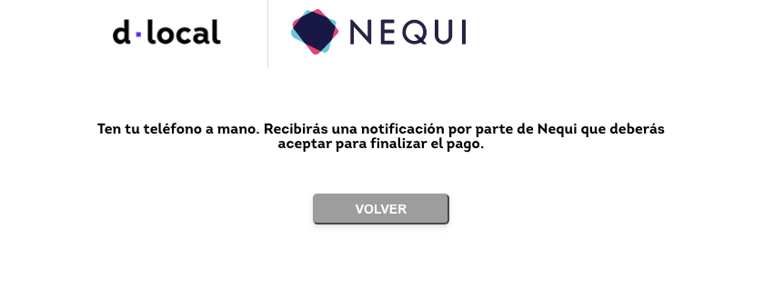

# Panama

### Payment Methods available

<table>
  <thead>
    <tr>
      <th style="text-align:left"><code>payment_<br />method_id</code>
      </th>
      <th style="text-align:left"><b>Name</b>
      </th>
      <th style="text-align:left"><code>payment_<br />method_type</code>
      </th>
      <th style="text-align:left"><code>brand</code>
      </th>
      <th style="text-align:left"><b>Details</b>
      </th>
      <th style="text-align:left">Allowed Flows</th>
      <th style="text-align:left"><b>Logo</b>
      </th>
    </tr>
  </thead>
  <tbody>
    <tr>
      <td style="text-align:left"><code>CARD</code>
      </td>
      <td style="text-align:left">Visa</td>
      <td style="text-align:left"><code>CARD</code>
      </td>
      <td style="text-align:left"><code>VI</code>
      </td>
      <td style="text-align:left">Credit Card</td>
      <td style="text-align:left">
        <p><code>DIRECT</code>
        </p>
        <p><code>REDIRECT</code>
        </p>
      </td>
      <td style="text-align:left">&#x200B;<a href="https://pay.dlocal.com/views/2.0/images/payments/VI.png">https://pay.dlocal.com/views/2.0/images/payments/VI.png</a>&#x200B;</td>
    </tr>
    <tr>
      <td style="text-align:left"><code>CARD</code>
      </td>
      <td style="text-align:left">MasterCard</td>
      <td style="text-align:left"><code>CARD</code>
      </td>
      <td style="text-align:left"><code>MC</code>
      </td>
      <td style="text-align:left">Credit Card</td>
      <td style="text-align:left">
        <p><code>DIRECT</code>
        </p>
        <p><code>REDIRECT</code>
        </p>
      </td>
      <td style="text-align:left">&#x200B;<a href="https://pay.dlocal.com/views/2.0/images/payments/MC.png">https://pay.dlocal.com/views/2.0/images/payments/MC.png</a>&#x200B;</td>
    </tr>
    <tr>
      <td style="text-align:left"><code>CARD</code>
      </td>
      <td style="text-align:left">Visa Debit</td>
      <td style="text-align:left"><code>CARD</code>
      </td>
      <td style="text-align:left"><code>VD</code>
      </td>
      <td style="text-align:left">Debit Card</td>
      <td style="text-align:left">
        <p><code>DIRECT</code>
        </p>
        <p><code>REDIRECT</code>
        </p>
      </td>
      <td style="text-align:left">&#x200B;<a href="https://pay.dlocal.com/views/2.0/images/payments/VD.png">https://pay.dlocal.com/views/2.0/images/payments/VD.png</a>&#x200B;</td>
    </tr>
    <tr>
      <td style="text-align:left"><code>CARD</code>
      </td>
      <td style="text-align:left">Mastercard Debit</td>
      <td style="text-align:left"><code>CARD</code>
      </td>
      <td style="text-align:left"><code>MD</code>
      </td>
      <td style="text-align:left">Debit Card</td>
      <td style="text-align:left">
        <p><code>DIRECT</code>
        </p>
        <p><code>REDIRECT</code>
        </p>
      </td>
      <td style="text-align:left">&#x200B;<a href="https://pay.dlocal.com/views/2.0/images/payments/MD.png">https://pay.dlocal.com/views/2.0/images/payments/MD.png</a>&#x200B;</td>
    </tr>
    <tr>
      <td style="text-align:left"><code>CARD</code>
      </td>
      <td style="text-align:left">Clave</td>
      <td style="text-align:left"><code>CARD</code>
      </td>
      <td style="text-align:left"><code>CV</code>
      </td>
      <td style="text-align:left">Debit Card</td>
      <td style="text-align:left"><code>REDIRECT</code>
      </td>
      <td style="text-align:left">&#x200B;<a href="https://static-dlocal.s3-eu-west-1.amazonaws.com/images/providers/CV.png
">https://static-dlocal.s3-eu-west-1.amazonaws.com/images/providers/CV.png</a>
      </td>
    </tr>
    <tr>
      <td style="text-align:left"><code>NQ</code>
      </td>
      <td style="text-align:left">Nequi</td>
      <td style="text-align:left"><code>TICKET</code>
      </td>
      <td style="text-align:left"></td>
      <td style="text-align:left">Wallet</td>
      <td style="text-align:left"><code>REDIRECT</code>
      </td>
      <td style="text-align:left"><a href="https://static-dlocal.s3-eu-west-1.amazonaws.com/images/providers/NQ.jpg">https://static-dlocal.s3-eu-west-1.amazonaws.com/images/providers/NQ.jpg</a>
      </td>
    </tr>
    <tr>
      <td style="text-align:left"><code>PV</code>
      </td>
      <td style="text-align:left">Punto Pago</td>
      <td style="text-align:left"><code>TICKET</code>
      </td>
      <td style="text-align:left"></td>
      <td style="text-align:left">Cash Payment</td>
      <td style="text-align:left">
        <p><code>DIRECT</code>
        </p>
        <p><code>REDIRECT</code>
        </p>
      </td>
      <td style="text-align:left"> <a href="https://static-dlocal.s3-eu-west-1.amazonaws.com/images/providers/PV.jpeg">https://static-dlocal.s3-eu-west-1.amazonaws.com/images/providers/PV.jpeg</a>
      </td>
    </tr>
    <tr>
      <td style="text-align:left"><code>CARD</code>
      </td>
      <td style="text-align:left">American Express</td>
      <td style="text-align:left"><code>CARD</code>
      </td>
      <td style="text-align:left"><code>AE</code>
      </td>
      <td style="text-align:left">Credit Card</td>
      <td style="text-align:left">
        <p><code>DIRECT</code>
        </p>
        <p><code>REDIRECT</code>
        </p>
      </td>
      <td style="text-align:left">&#x200B;<a href="https://pay.dlocal.com/views/2.0/images/payments/AE.png">https://pay.dlocal.com/views/2.0/images/payments/AE.png</a>
      </td>
    </tr>
    <tr>
      <td style="text-align:left"><code>CARD</code>
      </td>
      <td style="text-align:left">Discover</td>
      <td style="text-align:left"><code>CARD</code>
      </td>
      <td style="text-align:left"><code>DI</code>
      </td>
      <td style="text-align:left">Credit Card</td>
      <td style="text-align:left">
        <p><code>DIRECT</code>
        </p>
        <p><code>REDIRECT</code>
        </p>
      </td>
      <td style="text-align:left">&#x200B;<a href="https://pay.dlocal.com/views/2.0/images/payments/DS.png">https://pay.dlocal.com/views/2.0/images/payments/DS.png</a>
      </td>
    </tr>
    <tr>
      <td style="text-align:left"><code>CARD</code>
      </td>
      <td style="text-align:left">JCB</td>
      <td style="text-align:left"><code>CARD</code>
      </td>
      <td style="text-align:left"><code>JC</code>
      </td>
      <td style="text-align:left">Credit Card</td>
      <td style="text-align:left">
        <p><code>DIRECT</code>
        </p>
        <p><code>REDIRECT</code>
        </p>
      </td>
      <td style="text-align:left">&#x200B;<a href="https://pay.dlocal.com/views/2.0/images/payments/JC.png">https://pay.dlocal.com/views/2.0/images/payments/JC.png</a>
      </td>
    </tr>
  </tbody>
</table>

### Redirect APM - Wallet - Nequi



**Request Example**

```bash
curl -X POST \
    -H 'X-Date: 2018-02-20T15:44:42.310Z' \
    -H 'X-Login: sak223k2wdksdl2' \
    -H 'X-Trans-Key: fm12O7G9' \
    -H 'Content-Type: application/json' \
    -H 'X-Version: 2.1' \
    -H 'Authorization: V2-HMAC-SHA256, Signature: 1bd227f9d892a7f4581b998c21e353b1686a6bdad5940e7bb6aa596c96e0a6ec' \
    -d '{body}'
    https://api.dlocal.com/payments
```

**Request Example Body**

```text
{
    "amount": 10,
    "currency": "USD",
    "country": "PA",
    "payment_method_id": "NQ",
    "payment_method_flow": "REDIRECT",
    "payer": {
        "name": "#RANDOMNAME",
        "email": "#RANDOMEMAIL",
        "phone": "4832696773",
        "document": "12345678",
        "address": {
            "country": "BR",
            "state": "Santa Catarina",
            "city": "Florianopolis",
            "zip_code": "88058",
            "street": "Rodovia Armando Calil Bulos",
            "number": "5940"
        }
    },
    "order_id": "#RANDOMUUID",
    "description": "n7kk12VoBE",
    "notification_url": "http://conductor.sandbox.internal/robot-server/rest/generic/notification/new"
}
```



#### Response Example

```yaml
{
    "id": "D-4-f3f12c65-64ea-43b2-b941-caf004febf27",
    "amount": 10,
    "currency": "USD",
    "payment_method_id": "NQ",
    "payment_method_flow": "REDIRECT",
    "country": "PA",
    "created_date": "2021-02-02T15:27:16.000+0000",
    "status": "PENDING",
    "status_detail": "The payment is pending.",
    "status_code": "100",
    "order_id": "d450dd5e-3284-4ab6-8cd6-2033f33a190a",
    "description": "n7kk12VoBE",
    "notification_url": "http://conductor.sandbox.internal/robot-server/rest/generic/notification/new",
    "redirect_url": "http://catherine.dlocal.rc/collect/pay/pay/M-0897d67c-6815-4dd4-a801-779b160d6ef9?xtid=CATH-ST-1612279636-1385339883"
}
```



#### 

### Specific instructions

#### Redirect Page

After initiating a payment request, the user will be redirected to a static landing page that will appear this way:

####  



Translation for non-Spanish speakers:

“Have your phone nearby. You will receive a notification from Nequi that you will need to accept to complete the payment”.

