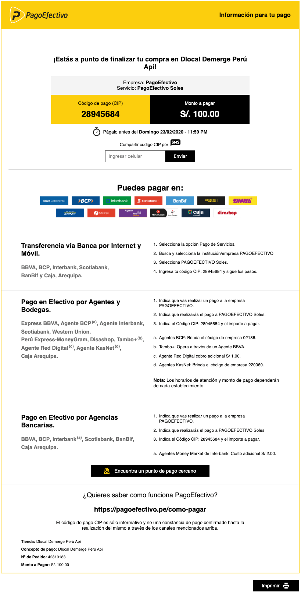

# Peru

### Payment Methods Available


<table>
  <thead>
    <tr>
      <th style="text-align:left"><code>payment_<br />method_id</code>
      </th>
      <th style="text-align:left"><b>Name</b>
      </th>
      <th style="text-align:left"><code>payment_<br />method_type</code>
      </th>
      <th style="text-align:left"><code>brand</code>
      </th>
      <th style="text-align:left"><b>Details</b>
      </th>
      <th style="text-align:left">Allowed Flows</th>
      <th style="text-align:left"><b>Logos</b>
      </th>
    </tr>
  </thead>
  <tbody>
    <tr>
      <td style="text-align:left"><code>CARD</code>
      </td>
      <td style="text-align:left">Visa</td>
      <td style="text-align:left"><code>CARD</code>
      </td>
      <td style="text-align:left"><code>VI</code>
      </td>
      <td style="text-align:left">Credit Card</td>
      <td style="text-align:left">
        <p><code>DIRECT</code>
        </p>
        <p><code>REDIRECT</code>
        </p>
      </td>
      <td style="text-align:left">&#x200B;<a href="https://pay.dlocal.com/views/2.0/images/payments/VI.png">https://pay.dlocal.com/views/2.0/images/payments/VI.png</a>&#x200B;</td>
    </tr>
    <tr>
      <td style="text-align:left"><code>CARD</code>
      </td>
      <td style="text-align:left">Mastercard</td>
      <td style="text-align:left"><code>CARD</code>
      </td>
      <td style="text-align:left"><code>MC</code>
      </td>
      <td style="text-align:left">Credit Card</td>
      <td style="text-align:left">
        <p><code>DIRECT</code>
        </p>
        <p><code>REDIRECT</code>
        </p>
      </td>
      <td style="text-align:left">&#x200B;<a href="https://pay.dlocal.com/views/2.0/images/payments/MC.png">https://pay.dlocal.com/views/2.0/images/payments/MC.png</a>&#x200B;</td>
    </tr>
    <tr>
      <td style="text-align:left"><code>CARD</code>
      </td>
      <td style="text-align:left">MasterCard Debit</td>
      <td style="text-align:left"><code>CARD</code>
      </td>
      <td style="text-align:left"><code>MD</code>
      </td>
      <td style="text-align:left">Debit Card</td>
      <td style="text-align:left">
        <p><code>DIRECT</code>
        </p>
        <p><code>REDIRECT</code>
        </p>
      </td>
      <td style="text-align:left">https://pay.dlocal.com/views/2.0/images/payments/MD.png&#x200B;</td>
    </tr>
    <tr>
      <td style="text-align:left"><code>CARD</code>
      </td>
      <td style="text-align:left">American Express</td>
      <td style="text-align:left"><code>CARD</code>
      </td>
      <td style="text-align:left"><code>AE</code>
      </td>
      <td style="text-align:left">Credit Card</td>
      <td style="text-align:left">
        <p><code>DIRECT</code>
        </p>
        <p><code>REDIRECT</code>
        </p>
      </td>
      <td style="text-align:left">&#x200B;<a href="https://pay.dlocal.com/views/2.0/images/payments/AE.png">https://pay.dlocal.com/views/2.0/images/payments/AE.png</a>&#x200B;</td>
    </tr>
    <tr>
      <td style="text-align:left"><code>CARD</code>
      </td>
      <td style="text-align:left">Diners Club</td>
      <td style="text-align:left"><code>CARD</code>
      </td>
      <td style="text-align:left"><code>DC</code>
      </td>
      <td style="text-align:left">Credit Card</td>
      <td style="text-align:left">
        <p><code>DIRECT</code>
        </p>
        <p><code>REDIRECT</code>
        </p>
      </td>
      <td style="text-align:left">&#x200B;<a href="https://pay.dlocal.com/views/2.0/images/payments/DC.png">https://pay.dlocal.com/views/2.0/images/payments/DC.png</a>&#x200B;</td>
    </tr>
    <tr>
      <td style="text-align:left"><code>CARD</code>
      </td>
      <td style="text-align:left">Visa Debit</td>
      <td style="text-align:left"><code>CARD</code>
      </td>
      <td style="text-align:left"><code>VD</code>
      </td>
      <td style="text-align:left">Debit Card</td>
      <td style="text-align:left">
        <p><code>DIRECT</code>
        </p>
        <p><code>REDIRECT</code>
        </p>
      </td>
      <td style="text-align:left">&#x200B;<a href="https://pay.dlocal.com/views/2.0/images/payments/VD.png">https://pay.dlocal.com/views/2.0/images/payments/VD.png</a>&#x200B;</td>
    </tr>
    <tr>
      <td style="text-align:left"><code>EF</code>
      </td>
      <td style="text-align:left">Pago Efectivo</td>
      <td style="text-align:left"><code>TICKET</code>
      </td>
      <td style="text-align:left"></td>
      <td style="text-align:left">Cash Payment</td>
      <td style="text-align:left">
        <p><code>DIRECT</code>
        </p>
        <p><code>REDIRECT</code>
        </p>
      </td>
      <td style="text-align:left">&#x200B;<a href="https://pay.dlocal.com/views/2.0/images/payments/EF.png">https://pay.dlocal.com/views/2.0/images/payments/EF.png</a>&#x200B;</td>
    </tr>
    <tr>
      <td style="text-align:left"><code>BC</code>
      </td>
      <td style="text-align:left">BCP</td>
      <td style="text-align:left"><code>BANK_TRANSFER</code>
      </td>
      <td style="text-align:left"></td>
      <td style="text-align:left">Bank Transfer Online</td>
      <td style="text-align:left">
        <p><code>DIRECT</code>
        </p>
        <p><code>REDIRECT</code>
        </p>
      </td>
      <td style="text-align:left">&#x200B;<a href="https://pay.dlocal.com/views/2.0/images/payments/BC.png">https://pay.dlocal.com/views/2.0/images/payments/BC.png</a>&#x200B;</td>
    </tr>
    <tr>
      <td style="text-align:left"><code>IB</code>
      </td>
      <td style="text-align:left">Interbank</td>
      <td style="text-align:left"><code>BANK_TRANSFER</code>
      </td>
      <td style="text-align:left"></td>
      <td style="text-align:left">Bank Transfer Online</td>
      <td style="text-align:left">
        <p><code>DIRECT</code>
        </p>
        <p><code>REDIRECT</code>
        </p>
      </td>
      <td style="text-align:left">&#x200B;<a href="https://pay.dlocal.com/views/2.0/images/payments/IB.png">https://pay.dlocal.com/views/2.0/images/payments/IB.png</a>&#x200B;</td>
    </tr>
    <tr>
      <td style="text-align:left"><code>BP</code>
      </td>
      <td style="text-align:left">BBVA</td>
      <td style="text-align:left"><code>BANK_TRANSFER</code>
      </td>
      <td style="text-align:left"></td>
      <td style="text-align:left">Bank Transfer Online</td>
      <td style="text-align:left">
        <p><code>DIRECT</code>
        </p>
        <p><code>REDIRECT</code>
        </p>
      </td>
      <td style="text-align:left">&#x200B;<a href="https://pay.dlocal.com/views/2.0/images/payments/BP.png">https://pay.dlocal.com/views/2.0/images/payments/BP.png</a>&#x200B;</td>
    </tr>
  </tbody>
</table>

## Direct Alternative Payment Methods

### Pago Efectivo

#### Example



#### Example Request

```bash
curl -X POST \
    -H 'X-Date: 2018-02-20T15:44:42.310Z' \
    -H 'X-Login: sak223k2wdksdl2' \
    -H 'X-Trans-Key: fm12O7G9' \
    -H 'Content-Type: application/json' \
    -H 'X-Version: 2.1' \
    -H 'Authorization: V2-HMAC-SHA256, Signature: 1bd227f9d892a7f4581b998c21e353b1686a6bdad5940e7bb6aa596c96e0a6ec' \
    -d '{body}'
    https://api.dlocal.com/payments
```

#### Example Request Body

```c
{
"amount": 100,
"currency": "PEN",
"country": "PE",
"payment_method_id": "EF",
"payment_method_flow": "DIRECT",
"payer": {
      "name": "Pedro Gomez",
      "email": "pedrogomez@dlocal.com",
      "document": "27662162"
},
"order_id": "jhg4v34v534",
"notification_url": "http://merchant.com/notification/new"
}
```



#### Example Response

```c
{
    "id": "D-4-a291131e-f640-4579-b5de-95a709522272",
    "amount": 100,
    "currency": "PEN",
    "payment_method_id": "EF",
    "payment_method_type": "TICKET",
    "payment_method_flow": "DIRECT",
    "country": "PE",
    "ticket": {
        "type": "CUSTOM",
        "number": "28945684",
        "expiration_date": "2020-02-24T04:59:00.000+0000",
        "id": "EF-28945684",
        "company_name": "DEMERGE PERU SAC",
        "provider_name": "PagoEfectivo",
        "provider_logo": "https://pay.dlocal.com/views/2.0/images/payments/EF.png",
        "image_url": "https://pay.dlocal.com/gmf/payments/M-e622da70-5295-11ea-addf-83f8a04e38b5",
        "amount": 100,
        "currency": "PEN"
    },
    "created_date": "2020-02-18T21:30:35.000+0000",
    "status": "PENDING",
    "status_detail": "The payment is pending.",
    "status_code": "100",
    "order_id": "bbca8035-6d49-4283-abe0-6be78d29d8d6",
    "notification_url": "http://conductor.sandbox.internal/robot-server/rest/generic/notification/new"
}
```






**User Interface Tips**

We strongly recommend using the ticket on the **ticket.image\_url**. Peruvian users are very familiar with this ticket \(example above\) made by the provider itself, for every kind of purchase paid through Pago Efectivo. It includes

* Many payment options instructions
* Capability of sending the payment code through SMS
* Provider’s store locator

If still need to design your own ticket, bear in mind:

* Show the **ticket.number** as _"Código de Pago \(CIP\)"_.
* Show the **ticket.provider\_name**, as it is useful at the moment of paying through homebanking.
* **Currency** and **amount** should be relevant elements in the ticket. Users need to be aware of that at all times.
* Make sure that the **expiration date** is clear and visible enough. In Perú people use the **dd/mm/yyyy** format.
* Include **payment instructions**. Although most users are familiarized with Pago Efectivo payment method, it is a good practice to help those who are not used to it. In the provider ticket \(image above\) there is an example of instructions, but if needed, our team will be happy to help you with more personalized instructions.
* A **Store locator feature** is a helpful feature. Just link it to the provider's tool: [https://ubicanos.pagoefectivo.pe/\#/?tienda=\[idServicio\]&moneda=\[idMoneda\]&monto=100.00&ubicame=true&\_k=zzuutu](https://ubicanos.pagoefectivo.pe/#/?tienda=[idServicio]&moneda=[idMoneda]&monto=100.00&ubicame=true&_k=zzuutu)
* A **Download button** helps users to have their ticket always on their phone, making it needless to take notes or keep the browser opened.
* A **Print button** is useful for some users that need to have their tickets printed.



