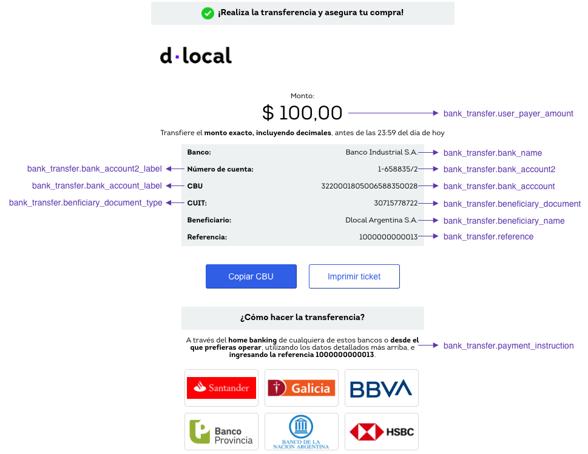

# Bank Transfer Payments

## Redirect Bank Transfer Payments

All Bank Transfer \(`BANK_TRANSFER`\) payment methods offer a redirect solution \(`payment_method_flow` = `REDIRECT`\). The API returns a `redirect_URL`, which is used to redirect the user to a dLocal-hosted page. The user will be able to see the details in order to complete the transfer via their home banking.

Using the Redirect method, the payment will have the `PENDING` status until the user completes the transfer, and dLocal gets notified.

The example below belongs to payment using Caixa in Brazil. For a full list of `BANK_TRANSFER` payment methods available, visit the [Payment Methods page](../payment-methods/).



#### Example Request <a id="example-request-3"></a>

```bash
curl -X POST \
    -H 'X-Date: 2018-02-20T15:44:42.310Z' \
    -H 'X-Login: sak223k2wdksdl2' \
    -H 'X-Trans-Key: fm12O7G9' \
    -H 'Content-Type: application/json' \
    -H 'X-Version: 2.1' \
    -H 'User-Agent: MerchantTest / 1.0 ' \
    -H 'Authorization: V2-HMAC-SHA256, Signature: 1bd227f9d892a7f4581b998c21e353b1686a6bdad5940e7bb6aa596c96e0a6ec' \
    -d '{body}'
    https://api.dlocal.com/payments
```

#### Example Request Body <a id="example-request-body"></a>

```yaml
{
    "amount": 100,
    "currency": "BRL",
    "country": "BR",
    "payment_method_id": "CA",
    "payment_method_flow": "REDIRECT",
    "payer": {
        "name": "Thiago Gabriel",
        "email": "thiago@example.com",
        "document": "52463567015"
    },
    "order_id": "623576234",
    "notification_url": "http://merchant.com/notifications"
}
```



#### Example Response

```yaml
{
    "id": "D-4-82f1d728-6966-41f8-8fea-fc9ee0e7cded",
    "amount": 100,
    "currency": "BRL",
    "payment_method_id": "CA",
    "payment_method_type": "BANK_TRANSFER",
    "payment_method_flow": "REDIRECT",
    "country": "BR",
    "created_date": "2018-12-26T21:19:02.000+0000",
    "status": "PENDING",
    "status_detail": "The payment is pending",
    "status_code": "100",
    "order_id": "623576234",
    "notification_url": "http://merchant.com/notifications",
    "redirect_url": "https://pay.dlocal.com/collect/pay/pay/M-de20ae10-0953-11e9-b88f-39144191f925?xtid=CATH-ST-1545859142-2123845504"
}
```




## Direct Bank Transfer Payments

Some Bank Transfer payments are available via our **Direct Bank Transfer** solution \(`payment_method_flow` = `DIRECT`\). The important parameters of the Bank Transfer ticket are returned via API, so the merchant can build their own UI.

The example below belongs to direct payment using Banco Industrial in Argentina. 



#### Example Request <a id="example-request-3"></a>

```bash
curl -X POST \
    -H 'X-Date: 2018-02-20T15:44:42.310Z' \
    -H 'X-Login: sak223k2wdksdl2' \
    -H 'X-Trans-Key: fm12O7G9' \
    -H 'Content-Type: application/json' \
    -H 'X-Version: 2.1' \
    -H 'User-Agent: MerchantTest / 1.0 ' \
    -H 'Authorization: V2-HMAC-SHA256, Signature: 1bd227f9d892a7f4581b998c21e353b1686a6bdad5940e7bb6aa596c96e0a6ec' \
    -d '{body}'
    https://api.dlocal.com/payments
```

#### Example Request Body <a id="example-request-body"></a>

```yaml
{
    "amount": 100,
    "currency": "ARS",
    "country": "AR",
    "payment_method_flow": "DIRECT",
    "payment_method_id": "IO",
    "payer": {
        "name": "Juan Gómez",
        "email": "jgomez@example.com",
        "phone": "4832695335",
        "document": "27183121",
        "address": {
            "country": "AR",
            "state": "Santa Fe",
            "city": "Rosario",
            "zip_code": "2341",
            "street": "Av. de las Acacias",
            "number": "5940"
        }
    },
    "order_id": "5346523564",
    "notification_url": "http://google.com"
}
```



#### Example Response

```yaml
{
    "id": "D-4-c36158e8-cf6b-4195-8cea-721d56ebb9b5",
    "amount": 100,
    "currency": "ARS",
    "payment_method_id": "IO",
    "payment_method_type": "BANK_TRANSFER",
    "payment_method_flow": "DIRECT",
    "country": "AR",
    "bank_transfer": {
        "bank_account_type": "CHECKING",
        "bank_name": "Banco Industrial S.A.",
        "bank_code": "BIND",
        "beneficiary_name": "Dlocal Argentina S.A.",
        "bank_account": "3220001805006588350028",
        "bank_account2": "1-658835/2",
        "bank_account_label": "CBU",
        "bank_account2_label": "Número de cuenta",
        "beneficiary_document_type": "CUIT",
        "beneficiary_document": "30715778722",
        "reference": "1000000000013",
        "redirect_url": "https://pay.dlocal.com/gmf-apm/payments/M-a4a6b0a4-59eb-4389-8a69-139b17a38b7a",
        "bank_branch": "1",
        "user_payment_amount": 100
        "payment_instruction": "A través de tu home banking, o desde el banco desde el que prefieras operar, utilizando la referencia y el resto de los datos detallados más arriba."
    },
    "ticket": {},
    "created_date": "2020-07-03T20:56:56.000+0000",
    "status": "PENDING",
    "status_detail": "The payment is pending.",
    "status_code": "100",
    "order_id": "5346523564",
    "notification_url": "http://google.com"
}
```





### The Bank Transfer Object

| **Property** | **Type** | **Description** |
| :--- | :--- | :--- |
| `bank_account_type` | String | Type of ticket, can be `CHECKING`or `SAVING` |
| `bank_name` | String | Name of the Bank |
| `bank_code` | String | Code of the Bank |
| `beneficiary_name` | String | Name of the account holder |
| `bank_account` | String | Bank account number |
| `bank_account2` | String | Secondary bank account number |
| `bank_account_label` | String | Label to be displayed related to `bank_account` |
| `bank_account2_label` | String | Label to be displayed related to `bank_account2` |
| `beneficiary_document_type` | String | Type of document of the account holder |
| `benficiary_document` | String | Document number of the account holder |
| `reference` | String | Reference code for the payer to add on payment |
| `redirect_url` | String | URL of the full version of the ticket. In case you want to redirect. |
| `user_payment_amount` | Number | Amount the user needs to pay |
| `payment_instruction` | String | Instructions for making the payment |

