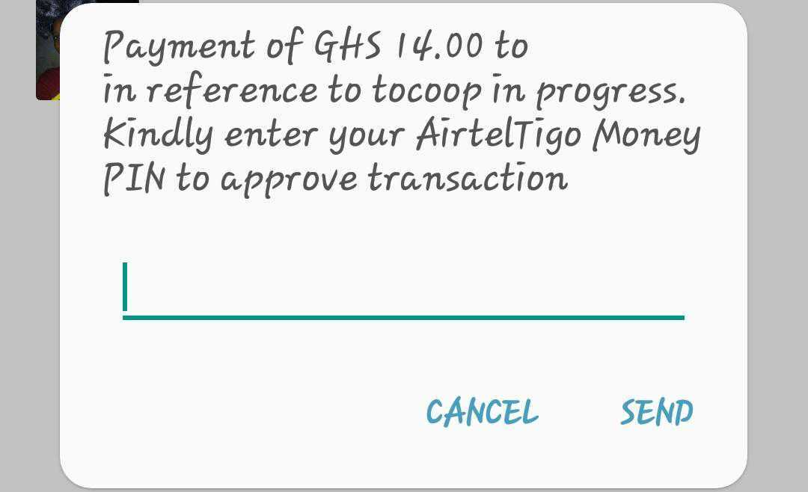

# Mobile Money Payments

Mobile Money is a service that stores funds in a secure electronic account, linked to the user's mobile phone number. It is provided by the same companies that run the local mobile phone services and is available to both pre-pay and contract customers. 

It allows users to store, send, and receive money using their mobile phone. They can buy items in shops or online, pay bills, school fees, and top up mobile airtime, and withdraw cash at authorized agents. Typically, the user's account with the telco includes two separate balances: phone call balances, and a wallet balance.


Mobile Money payments are available in Kenya, Ghana, Cameroon and Senegal


### Push notification example flow

User will input the phone number in the merchant's website, and a mobile money payment request with `payment_method_id` _=_ `MW`will be sent \(see an example below\).

The response will have the `PENDING` status until the user inputs the required PIN, and dLocal gets notified. This is an example of the push notification the user is receiving:



### Mobile Money request

Mobile money payments are available trough a DIRECT flow only and, as mentioned above, make sure you set`payment_method_id` _=_ `MW`. For a full list of country and currency codes, visit the [Country Reference page](../country-reference.md).


There's a specific parameter that is particularly mandatory for **Ghana**. Find and example request/response after the first example.



Sending `phone` is key so that the user can receive the push notification




Example request

```yaml
{
    "amount": 10000,
    "currency": "KES",
    "country": "KE",
    "payment_method_flow": "DIRECT",
    "payment_method_id": "MW",
    "payer": {
        "name": "David Otieno",
        "email": "dotieno@example.com",
        "phone": "+2544832695335",
        "document": "27183121",
        "address": {
            "country": "KE",
            "state": "Nairobi",
            "city": "Nairobi",
            "zip_code": "2341",
            "street": "Lusaka Rd",
            "number": "5940"
        }
    },
    "order_id": "9928451",
    "notification_url": "http://google.com"
}
```



```yaml
{
    "id": "D-4-a81b9060-3cde-452c-81b1-e82f2739fb47",
    "amount": 10000,
    "currency": "KES",
    "payment_method_id": "MW",
    "payment_method_type": "BANK_TRANSFER",
    "payment_method_flow": "DIRECT",
    "country": "KE",
    "bank_transfer": {},
    "ticket": {},
    "created_date": "2020-11-03T14:09:24.000+0000",
    "status": "PENDING",
    "status_detail": "The payment is pending.",
    "status_code": "100",
    "order_id": "9928451",
    "notification_url": "http://google.com"
}
```



### Mobile Money Request \(for Ghana\)

Particularly for Ghana, the mobile carrier is mandatory: `metadata.mobile_carrier`. Possible values for that parameter are `MTN`, `VODAFONE` or `TIGO`.



Request Example

```yaml

{
    "amount": 12.00,
    "currency" : "GHS",
    "country": "GH",
    "payment_method_id" : "MW",
    "payment_method_flow" : "DIRECT",
    "payer":{
        "name" : "David Otieno",
        "email" : "dotieno@example.com",
        "document" : "+23353033315550",
        "user_reference": "12345",
        "address": {
            "state"  : "Accra",
            "city" : "Accra",
            "zip_code" : "23321",
            "street" : "Servidao B-1",
            "number" : "1106"
        },
        "ip" : "179.27.83.210",
        "device_id" : "2fg3d4gf234"
    },
    "metadata": {
        "mobile_carrier": "MTN",
    }
    "order_id": "657434343",
    "notification_url": "http://merchant.com/notifications"
}
```



```yaml
{
    "id": "PAY2323243343543",
    "amount": 12.00,
    "currency" : "GHS",
    "country": "GH",
    "payment_method_id" : "MW",
    "payment_method_type" : "BANK_TRANSFER",
    "payment_method_flow" : "DIRECT",
    "created_date" : "2018-02-15T15:14:52-00:00",
    "status" : "PENDING",
    "status_code" : "100",
    "status_detail" : "The payment is pending.",
    "order_id": "657434343",
    "notification_url": "http://merchant.com/notifications"
}
```



