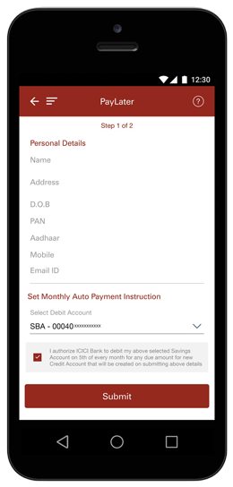
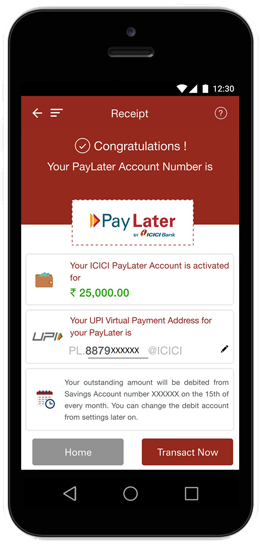

# PayLater Payments

## Redirect PayLater Payments

PayLater provides the end-user with an instant credit line. After selecting this payment method, the user is redirected and required to input some personal information. Once submitted, the user receives an approval message, and can use the credited amount as balance. Monthly payments will be automatically deducted from his bank account, until full amount completion. See the ICICI Bank example screenshots below:






PayLater is only available in India at the moment


PayLater payment methods fall under `BANK_TRANSFER` and offer a redirect solution \(`payment_method_flow` = `REDIRECT`\). The API returns a `redirect_URL`, which is used to redirect the user to the selected bank's PayLater page \(ICICI in the example above\).

Using the Redirect method, the payment will have the `PENDING` status until the user submits the information as shown in Picture 1 above, and dLocal gets notified.

The example below belongs to payment using PayLater from ICICI Bank in India. For a full list of `BANK_TRANSFER` payment methods available, visit the [Payment Methods page](../payment-methods/).



#### Example Request

```javascript
curl -X POST \
    -H 'X-Date: 2018-02-20T15:44:42.310Z' \
    -H 'X-Login: sak223k2wdksdl2' \
    -H 'X-Trans-Key: fm12O7G9' \
    -H 'Content-Type: application/json' \
    -H 'X-Version: 2.1' \
    -H 'User-Agent: MerchantTest / 1.0 ' \
    -H 'Authorization: V2-HMAC-SHA256, Signature: 1bd227f9d892a7f4581b998c21e353b1686a6bdad5940e7bb6aa596c96e0a6ec' \
    -d '{body}'
    https://api.dlocal.com/payments
```

#### Example request body

```sql
{
    "amount": 100,
    "currency": "INR",
    "country": "IN",
    "payment_method_id": "II",
    "payment_method_flow": "REDIRECT",
    "payer": {
        "name": "Gaurav Acharya",
        "email": "gaurav@example.com",
        "document": "ABCDE1234F"
    },
    "order_id": "623576234",
    "notification_url": "http://merchant.com/notifications"
}
```



```php
{
    "id": "D-4-82f1d728-6966-41f8-8fea-fc9ee0e7cded",
    "amount": 100,
    "currency": "INR",
    "payment_method_id": "II",
    "payment_method_type": "BANK_TRANSFER",
    "payment_method_flow": "REDIRECT",
    "country": "IN",
    "created_date": "2018-12-26T21:19:02.000+0000",
    "status": "PENDING",
    "status_detail": "The payment is pending",
    "status_code": "100",
    "order_id": "623576234",
    "notification_url": "http://merchant.com/notifications",
    "redirect_url": "https://pay.dlocal.com/collect/pay/pay/M-de20ae10-0953-11e9-b88f-39144191f925?xtid=CATH-ST-1545859142-2123845504"
}
```



