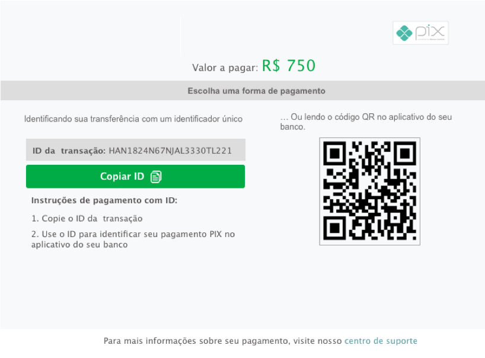

# PIX Payments

PIX is a Brazilian payment method, officially launched by the local Central Bank, that enables immediate payment confirmation and 24/7 availability. The user can complete the payment using any Home Banking or Ewallet App, by copying and pasting a Transaction ID or scanning a QR code \(see example in the next section\).


PIX payment method is only available in Brazil


PIX payments support a `REDIRECT` or `DIRECT` flow.

### Redirect PIX Payment

In this flow, `payment_method_flow` is set to `REDIRECT` . The API returns a `redirect_URL`, which is used to redirect the user to a dLocal-hosted page \(shown below\). The user will be able to open any App that supports PIX \(Home Banking and Ewallets\) and decide whether to use the scan QR or the Transaction ID copy/paste option.

Using the `REDIRECT` method, the payment will have the `PENDING` status until the user confirms the payment, and dLocal gets notified \(immediate after user confirmation\).





#### Example request body

```yaml
{
    "amount": 100,
    "currency": "BRL",
    "country": "BR",
    "payment_method_id": "PQ",
    "payment_method_flow": "REDIRECT",
    "payer": {
        "name": "Thiago Gabriel",
        "email": "thiago@example.com",
        "document": "53033315550"
    },
    "order_id": "5346523564",
    "notification_url": "http://merchant.com/notifications"
}
```





```yaml
{
    "id": "D-4-75c7473a-ab86-4e43-bd39-c840268747d3",
    "amount": 100,
    "currency": "BRL",
    "payment_method_id": "PQ",
    "payment_method_type": "TICKET",
    "payment_method_flow": "REDIRECT",
    "country": "BR",
    "created_date": "2020-11-16T20:37:20.000+0000",
    "status": "PENDING",
    "status_detail": "The payment is pending",
    "status_code": "100",
    "order_id": "5346523564",
    "notification_url": "http://merchant.com/notifications",
    "redirect_url": "https://dlocal.com/collect/pay/pay/M-0aa0cc00-094e-11e9-9f92-dbdad3ad0963?xtid=CATH-ST-1545856640-602791137"
}
```



### Direct PIX Payment

PIX payments are available via our **Direct APMs** solution \(`payment_method_flow` = `DIRECT`\). The important parameters are returned via API, so the merchant can build their own PIX UI.

Using the `DIRECT` method, the payment will have the `PENDING` status until the user confirms the payment, and dLocal gets notified \(immediate after user confirmation\).



```yaml
{
    "amount": 100,
    "currency": "BRL",
    "country": "BR",
    "payment_method_id": "PQ",
    "payment_method_flow": "DIRECT",
    "payer": {
        "name": "Thiago Gabriel",
        "email": "thiago@example.com",
        "document": "53033315550"
    },
    "order_id": "5346523564",
    "notification_url": "http://merchant.com/notifications"
}
```





```yaml
{
    "id": "D-4-75c7473a-ab86-4e43-bd39-c840268747d3",
    "amount": 100,
    "currency": "BRL",
    "payment_method_id": "PQ",
    "payment_method_type": "TICKET",
    "payment_method_flow": "DIRECT",
    "country": "BR",
    "ticket": {
        "type": "CUSTOM",
        "number": "QRS2-BTCN44FJ6HDQLB0DKKN2",
        "expiration_date": "2020-11-22T01:59:00.000+0000",
        "id": "QRS2-BTCN44FJ6HDQLB0DKKN2",
        "barcode": "iVBORw0KGgoAAAANSUhEUgAAAfQAAAH0CAIAAABEtEjdAABdsUlEQVR4XuzUwYolSbZs2/P/P/s",
        "company_name": "DLOCAL BRASIL LTDA",
        "provider_name": "pix",
        "provider_logo": "http://static-sandbox.dlocal.com/images/providers/pix.png",
        "image_url": "http://backoffice.dlocal.sandbox/gmf/payments/M-146aa2f0-094f-11e9-9f92-dbdad3ad0963"
    },
    "created_date": "2020-11-16T20:37:20.000+0000",
    "status": "PENDING",
    "status_detail": "The payment is pending",
    "status_code": "100",
    "order_id": "5346523564",
    "notification_url": "http://merchant.com/notifications"
}
```



