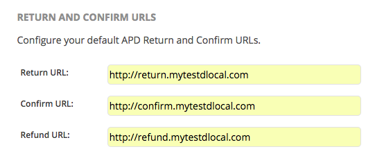

# Going live

Once all the testings in Sandbox responded correctly, you are ready to process the Going Live request.

In the **Live** panel, update the API credentials by replacing the test key with the production key. You also need to update the whitelisted IPs and the URL in the endpoint targets:

On parallel, dLocal will review the request, and make sure all the legal requirements are met. Once all the previous points are completed, dLocal will set your account to active. 

Now your business is live and ready to process payments with dLocal!

