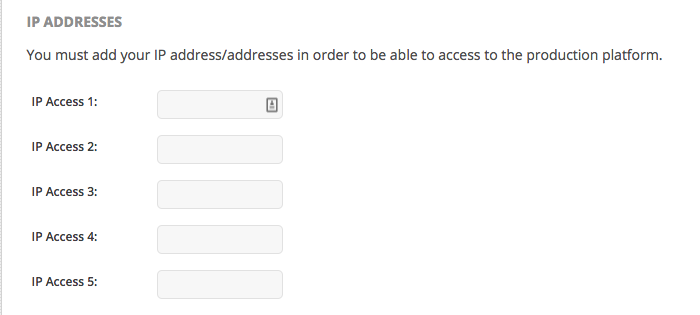
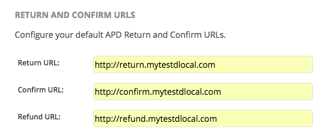
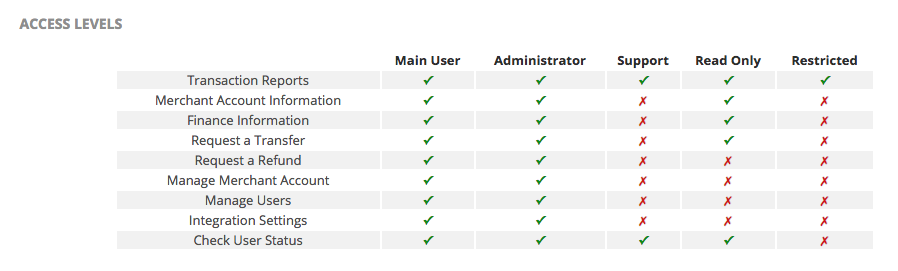

# Initial settings

Access _Integration &gt;&gt; Integration Settings_. The first thing you will see are the test credentials to be used for our Sandbox platform. We'll get to that later.

 Add the IP addresses you want to whitelist:

And input the Return, Confirmations and Refunds URLs:

**Return URL:** This is the URL that we will be redirecting the user to after the ticket or bank flows ends or the user decides go back. _We don't send notifications here_.  
  
**Confirm URL:** When a payment is created and the first status is `PENDING` , we will send a notification to this URL once the payment is either approved or rejected/expired.  
  
**Refund URL:** We send notifications for the refunds/chargebacks to this URL.

When you are done with the previous settings, and before starting to test in Sandbox, you can start adding some business-related information.

Access _Settings &gt;&gt; Merchant Account_ and input information like company name, main contact information, bank accounts and more.


Add as much information as you can. This will make communications in the future much smoother.


You can also start giving access to new users through _Settings &gt;&gt; Users_. Input the user email and set the level of access you want to assign them.

