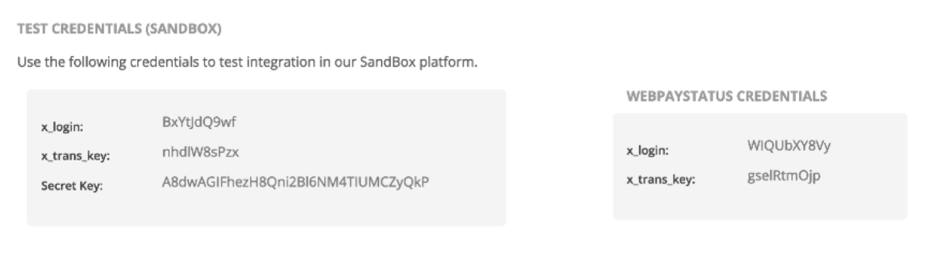

# Sandbox testing

The dLocal Sandbox is a self-contained, virtual testing environment that mimics the live dLocal production environment. It provides a shielded space where you can initiate and watch your application process the requests you make to the dLocal APIs without touching any live dLocal accounts.

When you initiate a transaction by using a sandbox account, dLocal creates a mock transaction that behaves exactly like a transaction in the live environment. All sandbox transactions are tracked on the Merchant Panel at [https://merchant.dlocal.com/](https://merchant.dlocal.com/) on the ‘TEST’ mode, and all production transactions are located under the ‘LIVE’ mode.

## The testing process

Test your application by creating a Sandbox account. When testing, use the test account in place of the live account you will use while processing live transactions. 

1. Make sure you have your dLocal account ready to go. Learn how to do that on the [Getting Started ](./#sign-up)page.
2. Format your dLocal API requests using the details from your test account and run them against the Sandbox endpoint\(s\). 
3. Review the responses and modify your application as necessary. 
4. When your application is fully functional and free of bugs, go live by updating the API credentials and endpoint targets.

## Get your API test credentials

All dLocal API requests require API credentials to verify the call is being made through a valid dLocal account. Calls to the sandbox testing environment are no different. While on ‘TEST’ mode, you can find your Sandbox credentials here: [https://merchant.dlocal.com/panel/integrations](https://merchant.dlocal.com/panel/integrations)




If you are integrating Smart Fields, you are going to need an API key. Please contact your Technical Account Manager to get yours.


## Make Test Calls

After you have your sandbox API credentials, you can make dLocal requests to the sandbox environment.

The endpoint for all sandbox API calls starts with [https://sandbox.dlocal.com/](https://sandbox.dlocal.com/) . If you decide to go live, you should change your endpoints to [https://api.dlocal.com/](https://api.dlocal.com/) .

## Testing Payments

You can test payments using the Create a Payment API method, just remember to use the [https://sandbox.dlocal.com/payments](https://sandbox.dlocal.com/payments) endpoint.

In Sandbox, all Credit Card payments are **automatically approved by default**. If you want to test the response of all possible errors, you can do so with the following trick exclusive for sandbox: 

* On the `description` body parameter of the Create a Payment you can include the error code that you want the payment to result to.
* For example: `description`: “302” will result in the payment being rejected with the error: “Insufficient Amount”.
* You can check the [full list of error codes available here](https://docs.dlocal.com/api-documentation/payins-api-reference/payments#rejection-status).

## Testing Examples

Take the following payment request as an example:

#### Example Request

```typescript
curl -X POST \
    -H 'X-Date: 2018-02-20T15:44:42.310Z' \
    -H 'X-Login: sak223k2wdksdl2' \
    -H 'Authorization: V2-HMAC-SHA256, Signature: 1bd227f9d892a7f4581b998c21e353b1686a6bdad5940e7bb6aa596c96e0a6ec' \
    -H 'X-Content-Type: application/json' \
    -d '{body}'
    https://sandbox.dlocal.com/payments
```

#### Example request body

```yaml
{
    "amount": 120.00,
    "currency" : "USD",
    "country": "BR",
    "payment_method_id" : "CARD",
    "payment_method_flow" : "DIRECT",
    "payer":{
        "name" : "Thiago Gabriel",
        "email" : "thiago@example.com",
        "document" : "53033315550",
        "user_reference": "12345",
        "address": {
            "state"  : "Rio de Janeiro",
            "city" : "Volta Redonda",
            "zip_code" : "27275-595",
            "street" : "Servidao B-1",
            "number" : "1106"
        }
    },
    "card":{
        "token": "CV-124c18a5-874d-4982-89d7-b9c256e647b5",
    },
    "order_id": "657434343",
    "description": "Testing Sandbox",
    "notification_url": "http://merchant.com/notifications"
}
```

We'll use it as an example to show how you should perform tests in Sandbox environment. Pay special attention to the `description` property, which will be very useful when **testing the suggested scenarios:**

1. Payment with Credit Card `PAID`
2. Payment with Credit Card `REJECTED`


**Make sure you are using the correct data for your own testing cases**


### **Payment with Credit Card approved \(‘PAID’\)**

As we mentioned earlier, you need to add the status code you want to test on the description body parameter of your request. In this case, we want to test status `PAID`, so we'll use code `200`. As you are testing cards, make sure you are correctly inputing CARD as the selected payment method. 

```yaml
"payment_method_id" : "CARD",
"description": "200",
```

This is the response you should expect for the specified properties in this test:

```yaml
"status" : "PAID",
"status_code" : "200",
"status_detail" : "The payment was paid.",
```

As you can see, the testing response is  showing `PAID` as the payment status, and `200` as the status code. 

### **Testing payment with credit card rejected**

The same goes to test the `REJECTED` status, but with `300` as the input code:

#### Request:

```yaml
"description": "300",
```

#### Response:

```yaml
"status" : "REJECTED",
"status_code" : "300",
"status_detail" : "The payment was rejected.",
```

As we mentioned earlier, you can include in `description` the error code that you want the payment to result to. For example, "302" will result in the payment being rejected with the error: "Insufficient Amount".

