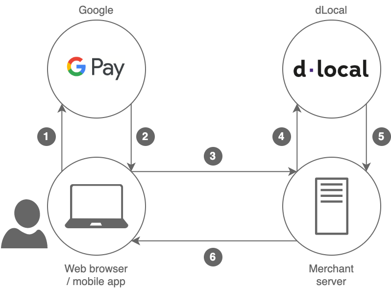

# Google Pay™

Google Pay is a convenient payment system which allows customers to make payments in your app or website using any credit or debit card saved to their Google Account.

Since Google devices are widely used in the countries where dLocal operates, supporting Google Pay in your app can help **simplify the checkout process and increase conversions**, as payment details are recovered from the customers' Google Accounts whenever they have previously saved or used their credit or debit cards with Google Pay.


As of Jan 2020, Google Pay is supported in the following countries: Argentina, Brazil, Chile, Colombia, Egypt, India, Indonesia, Mexico, Peru, Uruguay

For a more up to date list, please see: [https://support.google.com/pay/answer/9023773?hl=en](https://support.google.com/pay/answer/9023773?hl=en)

For details on the card networks supported, please see the [Payment Methods](https://docs.dlocal.com/api-documentation/payins-api-reference/payment-methods#payment-methods-by-country) section.


## Payment flow



1. The customer clicks on the Google Pay button in the merchant's client, whether it is an online store or app. The merchant initiates the Google Pay request using the Google Pay Web API or Android SDK.
2. After the customer selects his payment method or provides his payment details, Google replies with a token.
3. The merchant's client submits this information to the merchant's backend.
4. In the payment request to dLocal, the merchant includes the token received in step 2.
5. dLocal processes the payment using the Google Pay token and returns the payment confirmation to the merchant.
6. The merchant then notifies the customer that the payment has been successful.

## Integration

Supporting Google Pay requires following these two steps: 

### Step 1 - Google Integration \(Frontend\)

* For **Web** integration, please see the [Google Pay / Web](https://developers.google.com/pay/api/web/guides/setup) documentation, along with the [Web integration checklist](https://developers.google.com/pay/api/web/guides/test-and-deploy/integration-checklist) and [Web brand guidelines](https://developers.google.com/pay/api/web/guides/brand-guidelines).
* For **Android / SDK** integration, please see the [Google Pay / Android](https://developers.google.com/pay/api/android/guides/setup) documentation, along with the [Android integration checklist](https://developers.google.com/pay/api/android/guides/test-and-deploy/integration-checklist) and [Android brand guidelines](https://developers.google.com/pay/api/android/guides/brand-guidelines).


**When performing this step use the following parameters:** 

* **`gatewayMerchantId`** – You can obtain this value from your TAM
* **`gateway`** - use **`dlocal`** as the parameter value
* Required fields: Name, address, phone, and email



**Required document information** 

Please remember to also **request the user's personal ID document** before or after the user clicks on the Google Pay button and sending it to dLocal in the **`payer`** object, as this is a requirement for payment.



**Supported Payment Methods**

For supported payment type, select **`CARD`**. The following card networks are currently supported:

* VISA
* ELECTRON
* MASTERCARD
* MAESTRO
* AMEX
* DISCOVER
* JCB \(Only for Brazil\)
* ELO \(Only for Brazil\)
* ELO\_DEBIT \(Only for Brazil\)

For supported authentication methods use**`PAN_ONLY`**


### Step 2 - dLocal Integration \(Backend\)

You will need to submit the [standard payment request](https://docs.dlocal.com/api-documentation/payins-api-reference/payments) using the following parameter values: 

* **`payment_method_id`** should be **`CARD`**
* **`card.gpay_token`** should be the **json** obtained in the Google Integration step. It is important to send a json object and not a string in this parameter.



#### Example Request body

```javascript
{
    "amount": 120.00,
    "currency" : "BRL",
    "country": "BR",
    "payment_method_id" : "CARD",
    "payment_method_flow" : "DIRECT",
    "payer":{
        "document" : "53033315550",
        "name": "Ricardo Gomes"
    },
    "card":{
         "gpay_token": {
            "signature": "MEQCIBllBeoYFjIvIjPZmYG..."
          }         
    },
    "order_id": "657434343",
    "notification_url": "http://merchant.com/notifications"
}
```



#### Example Payment response

```javascript
{
    "id": "D-4-cf8eef6b-52d5-4320-b5ea-f5e0bbe4343f",
    "amount": 120.00,
    "currency": "BRL",
    "payment_method_id": "CARD",
    "payment_method_type": "CARD",
    "payment_method_flow": "DIRECT",
    "country": "BR",
    "card": {
            "holder_name": "Ricardo Gomes",
            "expiration_month": 12,
            "expiration_year": 2025,
            "brand": "VI",
            "last_4": "1111"
        },
    "created_date": "2018-12-26T20:26:09.000+0000",
    "approved_date": "2018-12-26T20:26:09.000+0000",
    "status": "PAID",
    "status_detail": "The payment was paid",
    "status_code": "200",
    "order_id": "657434343",
    "notification_url": "http://merchant.com/notifications"
}
```



## Getting ready to go live

After you have completed all the necessary steps of the integration process in the testing environment, please make sure you have requested [Google Production Access](https://services.google.com/fb/forms/googlepayAPIenable/), as detailed in the Google [Web](https://developers.google.com/pay/api/web/guides/test-and-deploy/request-prod-access) and [Android](https://developers.google.com/pay/api/web/guides/test-and-deploy/request-prod-access) documentation, and have updated your Google integration configuration \(Step 1\) for Production environment access. Finally, make sure you have contacted your Technical Account Manager so that we can help check everything has been correctly configured and confirm you are ready to go live.

