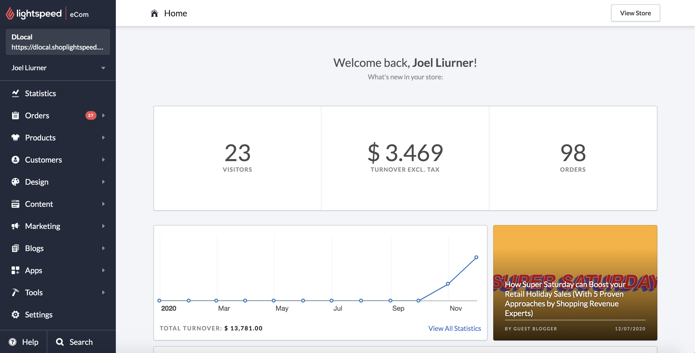
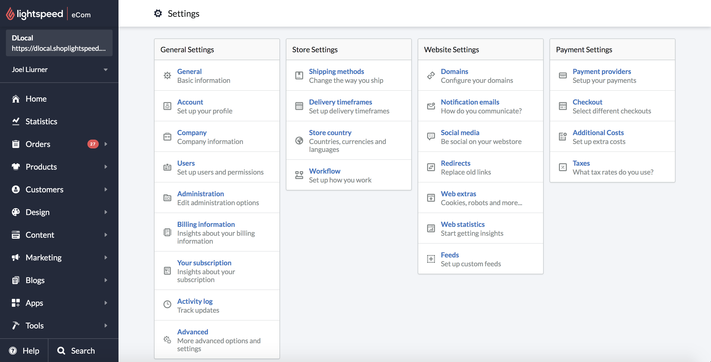
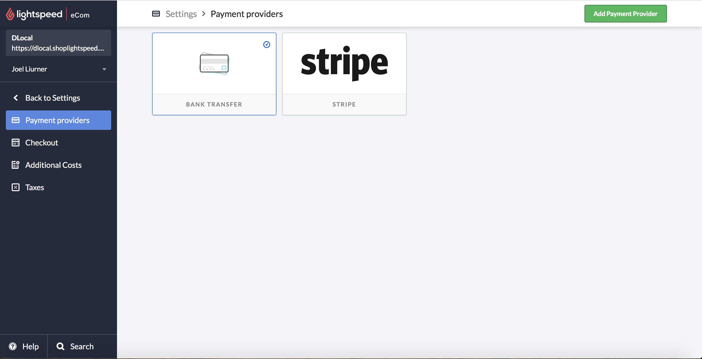
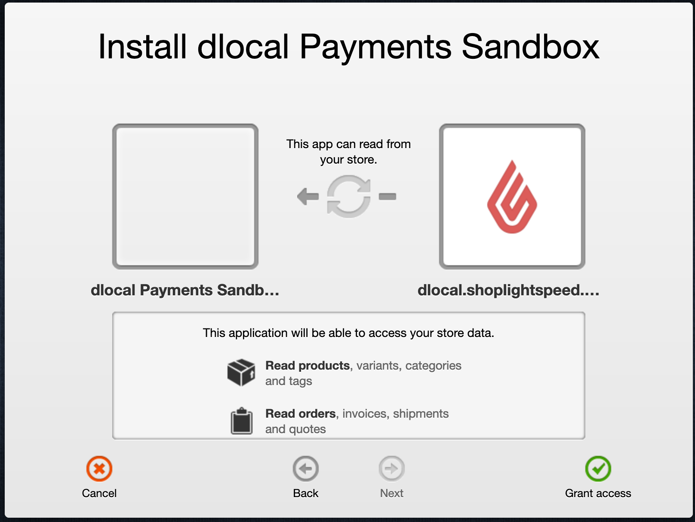
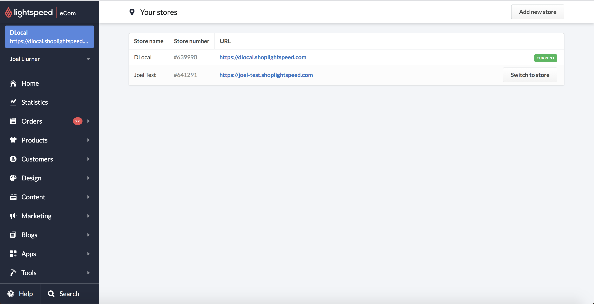

# Lightspeed

### 1. Login and locate 'Payment provider' menu

Login through the admin URL: [http://dlocal.shoplightspeed.com/admin](http://dlocal.shoplightspeed.com/admin)

2. Settings: Locate the Settings link in the menu

3. Payment providers: Select Payment providers under Payment Settings

4. Select dLocal: dLocal will be listed as payment provider

5. Access permit: Accept dLocal and lightbox access request

7. Instructions page. Redirect to a page with instructions, asking:

* Store Name
* Store URL
* Registered email
* Store number

