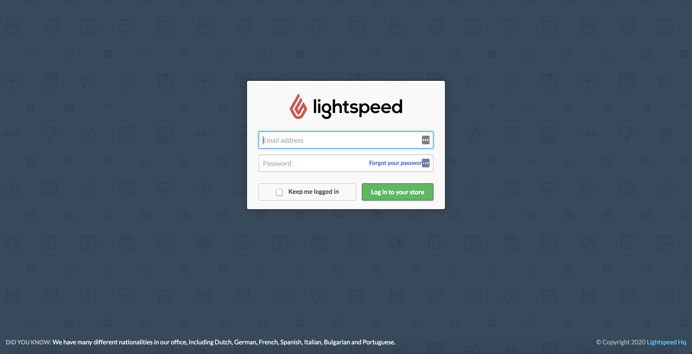
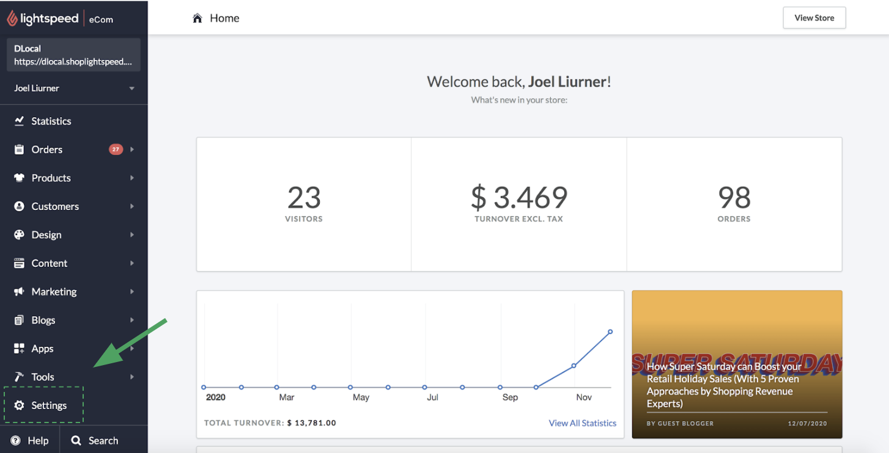
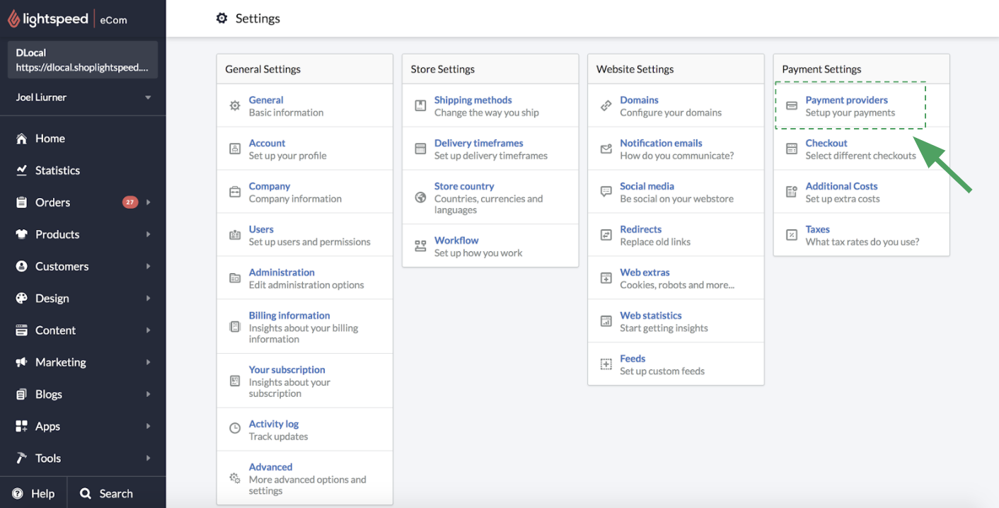
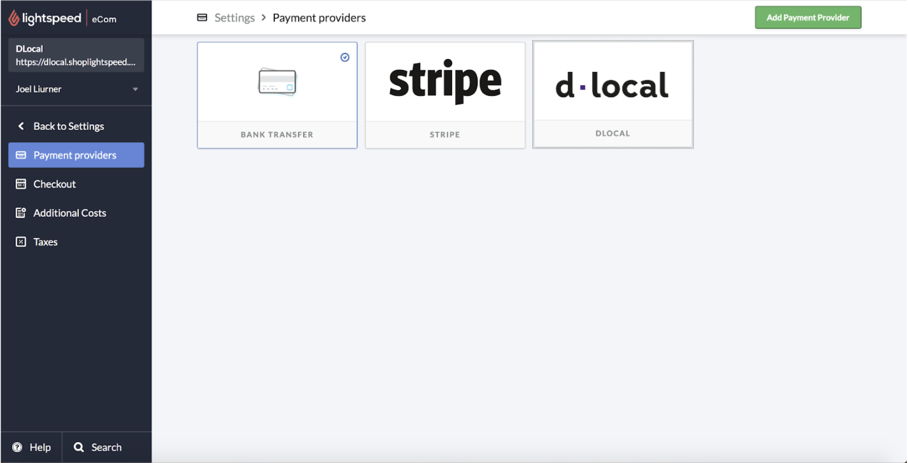
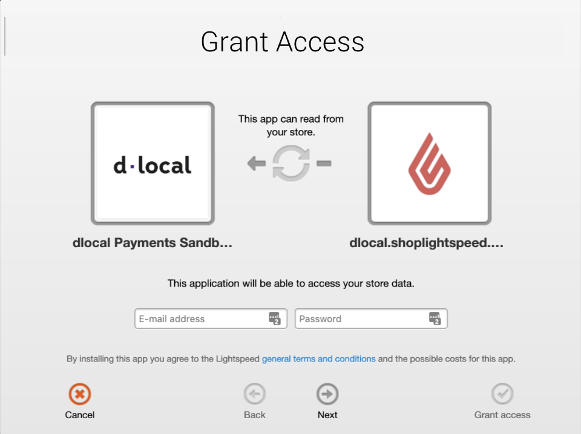
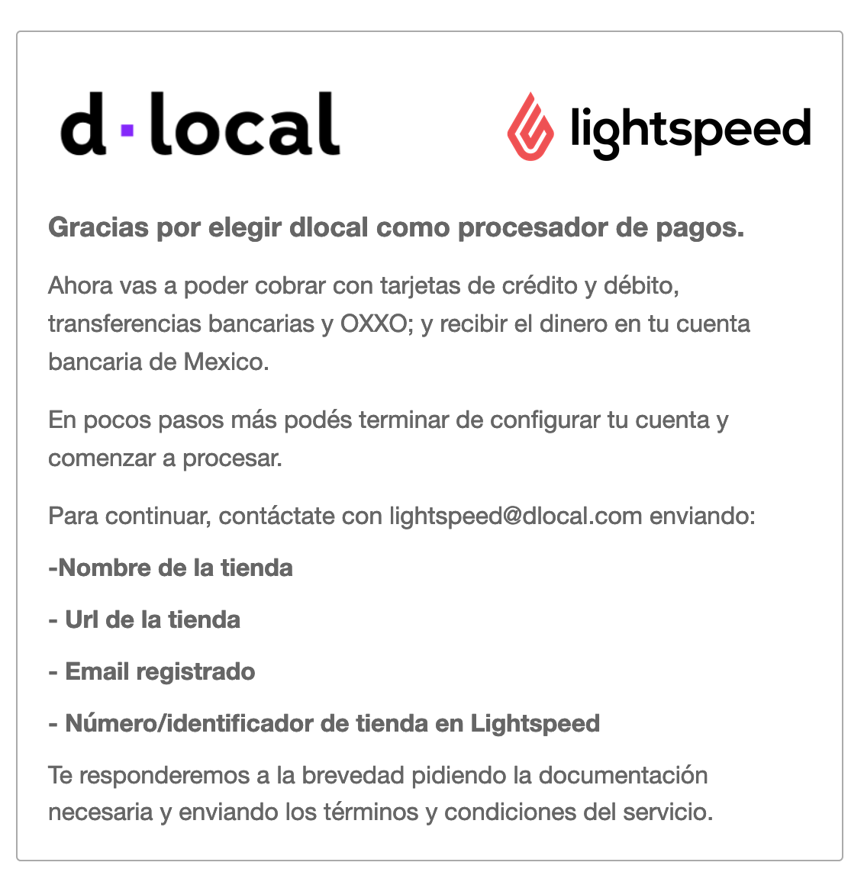
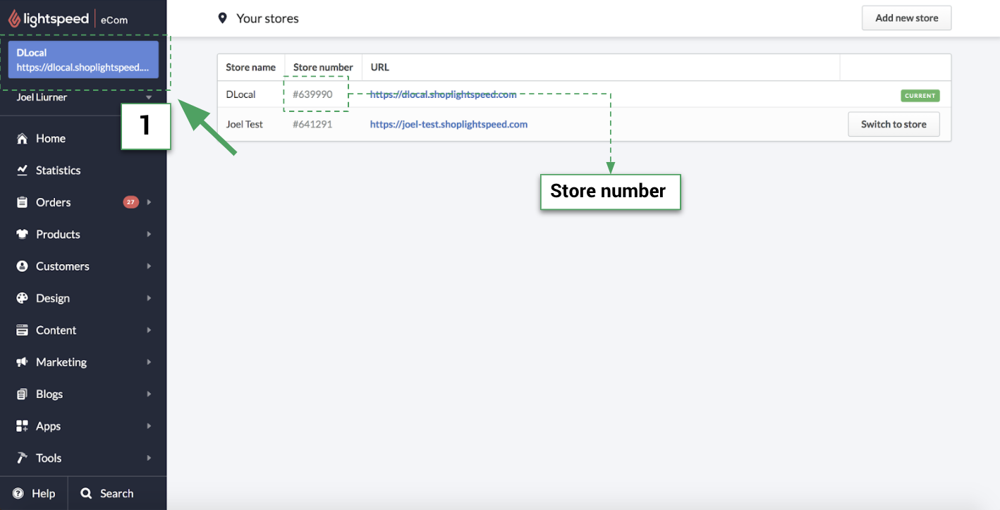

# Lightspeed setup

### 1. Login and locate 'Payment provider' menu

Start by logging in through the admin URL: [http://dlocal.shoplightspeed.com/admin](http://dlocal.shoplightspeed.com/admin)

Locate the `Settings` link in the menu on the left \(at the bottom\):

Payment providers: Select `Payment providers` under `Payment Settings`

### 2. Select dLocal as preferred payment provider

dLocal will be listed as payment provider in Mexico. Click on it.

### 3. Grant access to dLocal

Dialogue like the one shown below will be displayed for you to grant access. You will need to input your login information once again, and click on `Grand access`

### 4. Send application email 

After granting access you will be redirected to a page with instructions, asking you to send an email to lightspeed@dlocal.com \(as shown in the image below\), including the following data points:

* Store Name
* Store URL
* Registered email
* Store number

#### 4.1 Where to find the Store number?

Click on the store URL at the top-left of your screen to reach the store listing as shown in the image below. There you will find your store's number:

### 5. Sign the documents

After sending your application email, you will receive an email response from dLocal, with two files attached: Terms & Conditions and KYC \(Know your Customer\).

Please sign them and returning back to the same email address.

### 6. Wait for the setup confirmation

After 3 to 7 days you’ll receive an email from dLocal confirming that the store is ready to process payments in Mexico

That's it! Time to sell :\)  

