# Shopify setup

Follow these 3 steps and start collection payments:

1. [Sign up at dLocal](shopify.md#1-sign-up-a-dlocal-account)
2. [Set dLocal as an Alternative Payment Method in Shopify ](shopify.md#2-set-dlocal-as-a-payment-method-in-shopify)
3. [Set up your logo to display in the checkout](shopify.md#3-set-up-your-logo-to-display-in-the-checkout)

### 1. Sign up a dLocal account

The first step is to create a new dLocal merchant account here: [https://merchant.dlocal.com/sign\_up](https://merchant.dlocal.com/sign_up)

After submitting information, you will receive a confirmation link from merchants@dlocal.com in your email address. Verify the link, and you are all set to access the panel.

Access the merchant panel through [https://merchant.dlocal.com/login](https://merchant.dlocal.com/login) using the email and password you set when signing up.


Remember to change your password after your first sign in. You can do that through _Settings &gt;&gt; Change my password._


Follow the steps in this [guide](https://docs.dlocal.com/guides/getting-started) to complete the signup

### 2. Set dLocal as a payment method in Shopify

a. Once logged in your Shopify account, locate the _**Settings**_ button at the bottom-left corner:

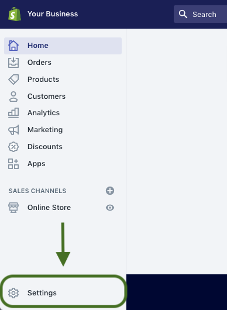

b. Click on the _**Payment providers**_ link:

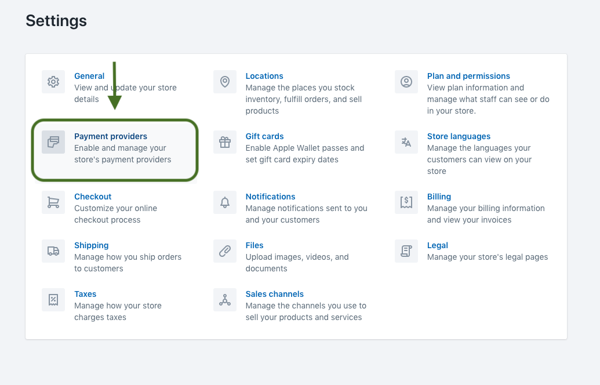

c. Look for the _**Alternative payment methods**_ section, and click on the button:

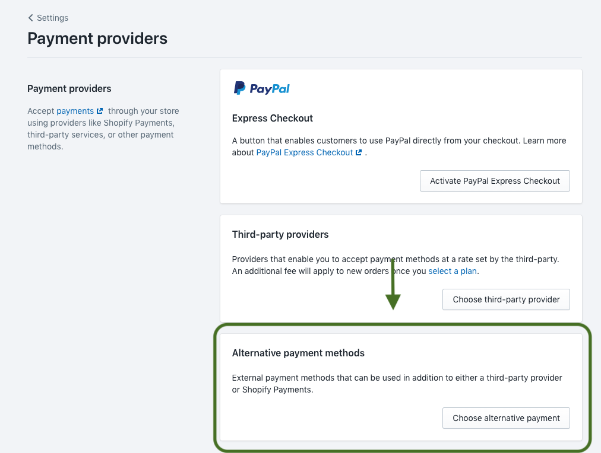

d. Select _**dLocal:**_

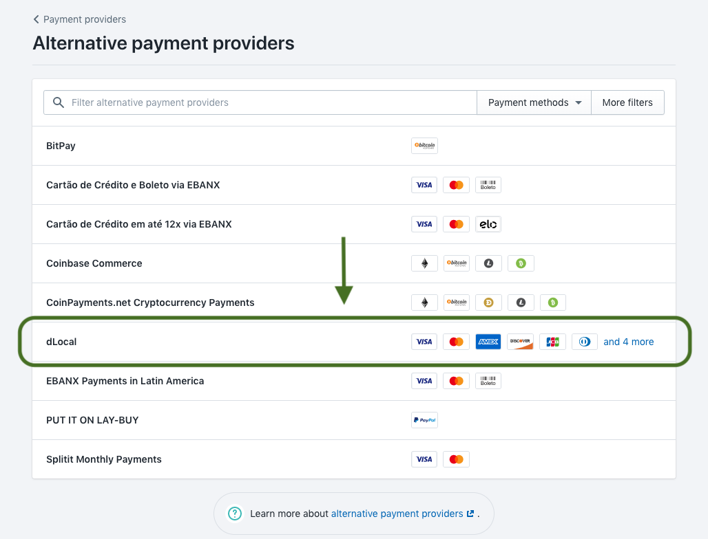

You will find three different gateways:

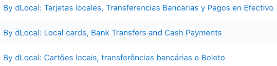

Set the correct gateway to improve conversion. Choose the first one for Spanish speaking countries \(LATAM excluding Brazil\). Choose the third option in portuguese for a store selling to Brazilian customers. Choose the second one in English for all remaining countries.

e. Input the dLocal's _**API keys**_ \(continue below to see where to find them\):

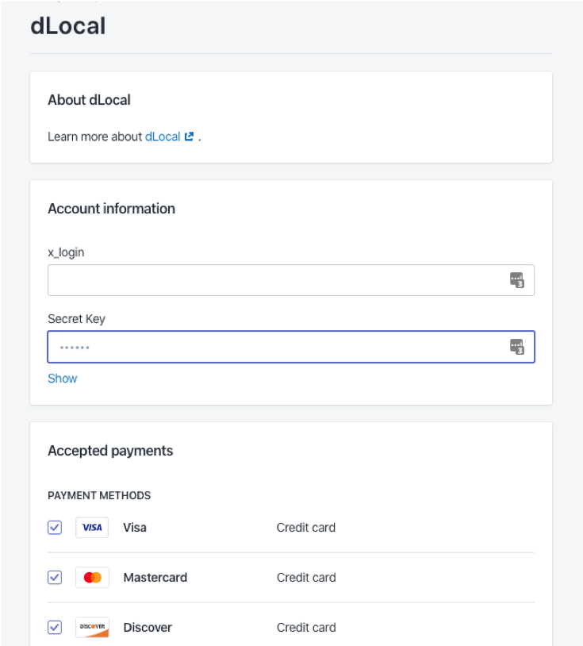

**Where can you find the keys?** The values can be found at dLocal’s merchant panel.  Locate the _**Integration**_ Tab, and click on _**Credentials & Settings**_. You'll see them there**:**

f. Select the _**payment methods**_ you want to be displayed to your users:

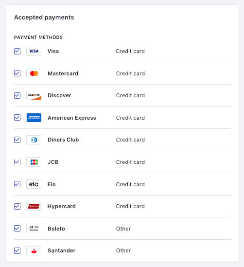


You do not need to select all payment methods. Don't worry, all of them will be available for the user to pay. Given that the space within checkout is reduced, Shopify will only allow 4 icons. It is recommended to choose only few as these are the logos to be displayed. 

* For Brazil Gateway: Visa, Mastercard, Boleto, ELO
* For Other Countries: Ask your TAM for recommended logos to display


When you finish your selection, click on the _**Activate dLocal**_ button.

g. Make sure Shopify’s _**Customer contact**_  is set to only "check out using email":

Go back to _**Settings**_, and click on _**Checkout:**_

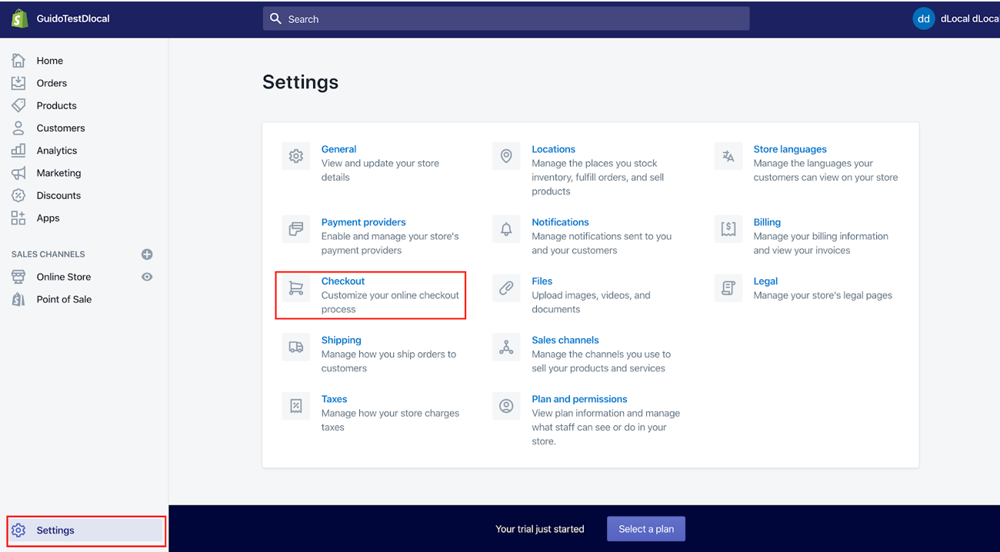

Once you get there, make sure that _**To check out**_ \(under _**Customer contact**_\) is set to the second option, as shown in the following picture: 

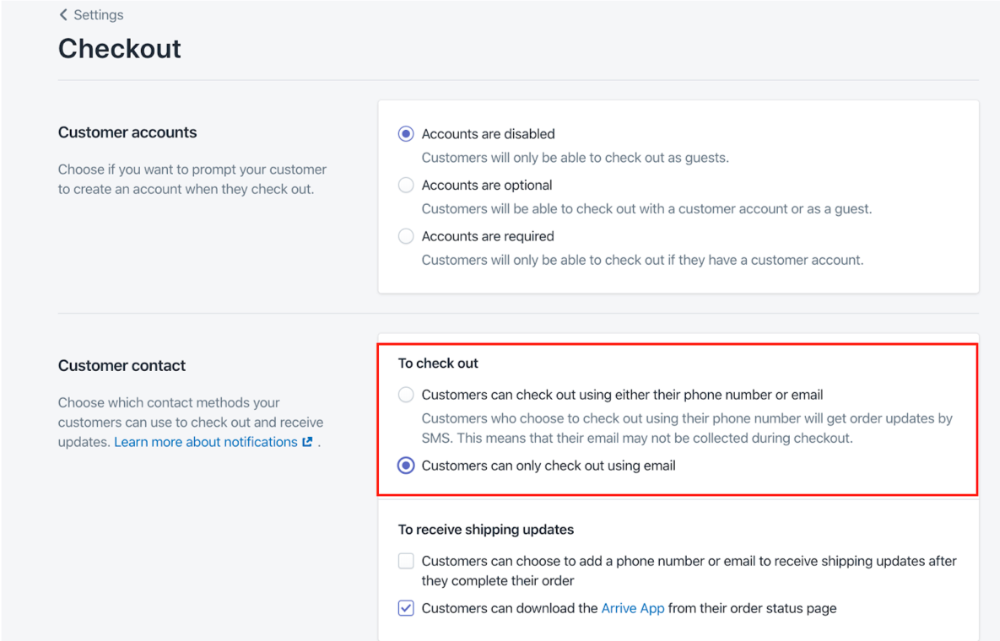

h. Make sure your currencies are adequately configured. The billing address country should match the store's currency. i.e.: Brazil and Reals. The exception for this rule is if you set USD \(US dollars\) as the currency, in which case can be matched with any country in the Billing address. 

The store currency can be set/changed through _**Settings**_ &gt; _**General**_ &gt; _**Store currency**_

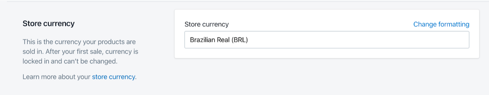

The address is typically configured in the store's website:

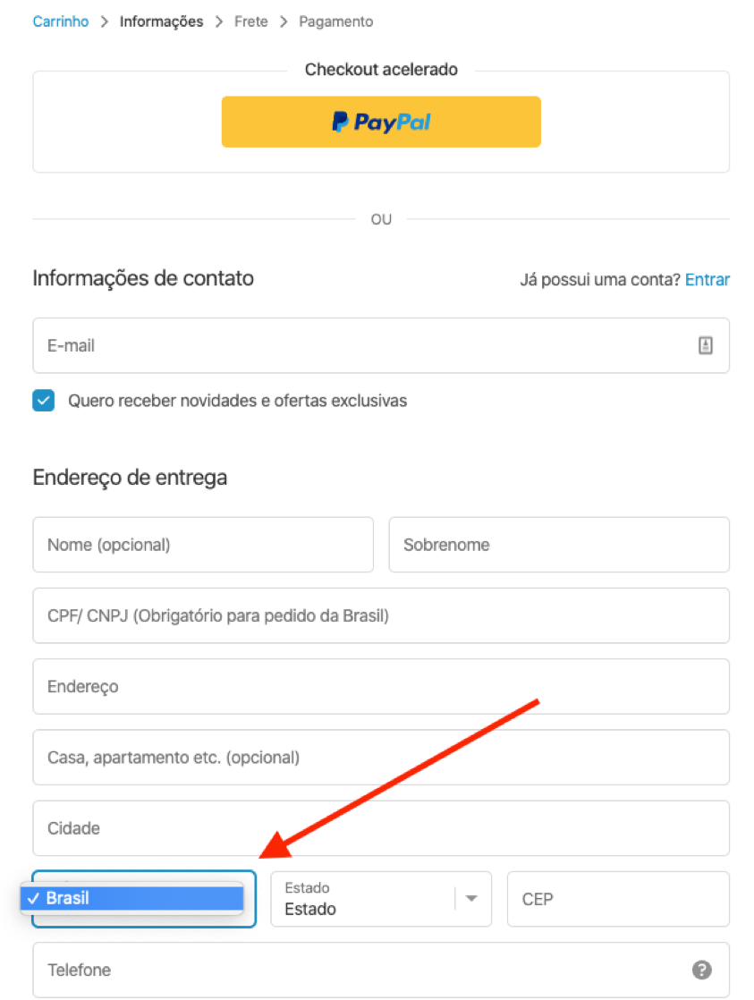

### 3. Set up your logo to display in the checkout

Configure your dLocal account’s logo on the merchant panel \(Settings tab  &gt;Merchant Account\) Remember the logo configured will be displayed to the users at dLocal’s checkout. Note: The image uploaded length should be at least over 200px.

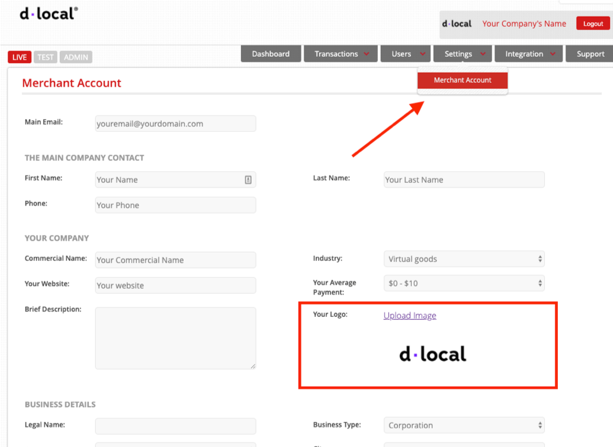

