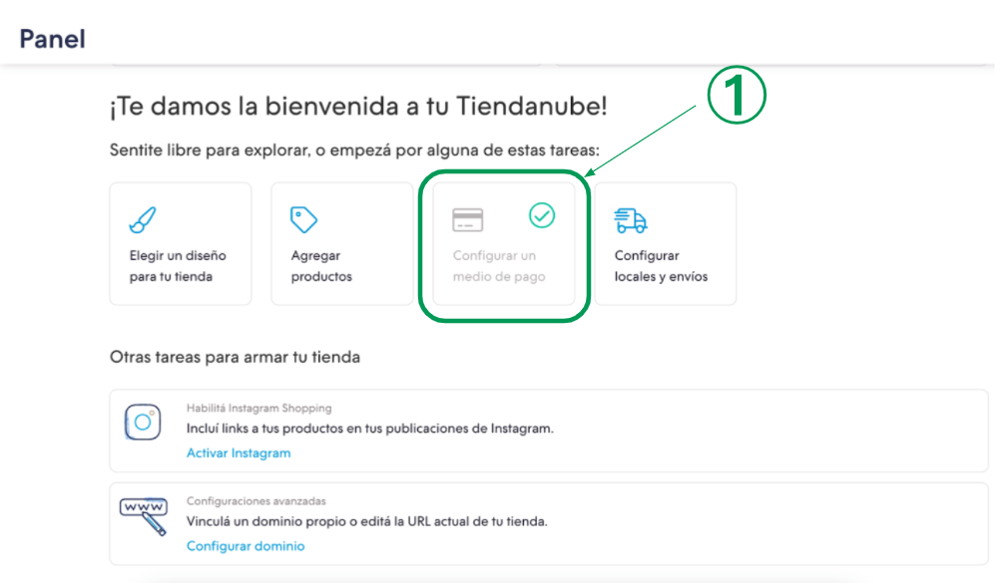

# Tienda Nube setup

**Pre-requisito: Crear tu cuenta en dLocal**  
Crea tu cuenta como comerciante en el siguiente link: [https://merchant.dlocal.com/sign\_up](https://merchant.dlocal.com/sign_up)

Luego de enviar la información recibirás un correo de confirmación desde la cuenta merchants@dlocal.com. Por favor verifica el link para poder empezar a utilizar tu panel de administrador. 

**Activa dLocal en tu Tienda Nube**

Paso 1: Ve al inicio de tu tienda. Por ejemplo: http://_ejemplo_.mitiendanube.com

Paso 2: Ve a “Configurar un medio de pago”

Paso 3: En una nueva pestaña o ventana, ingresa al link proporcionado por dLocal

**Configurar medios de pago**

_Tip: Recuerda que tenemos las tarifas más bajas del mercado_  
**Paso 5: Completa los datos legales de tu empresa y presiona continuar** 

  
  
**Paso 6: Completa los datos bancarios de tu empresa y presiona continuar**

**Paso 7: ¡Éxito! Has configurado dLocal exitosamente**

_Tip: Recuerda que luego puedes activar y desactivar cualquiera de nuestros 30 países desde tu panel de control_

