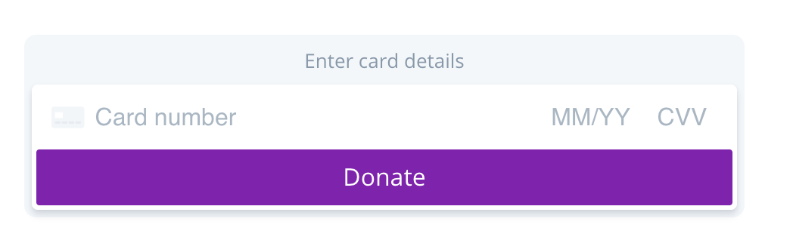

# Fields

In order to be eligible for the easiest level of PCI compliance – [SAQ A](https://www.pcisecuritystandards.org/pci_security/completing_self_assessment) – certain payment fields on the checkout page must be hosted securely. This requires you to host the information on an external payment gateway's domain and present the fields to your users in an iframe or with a redirect.

dLocal's Fields solution accomplishes this by rendering an iframe to handle input of the following payment fields on your checkout page: Card Number, CVV and Expiration date.

This provides you with the ability to customize the look and feel of your web page while ensuring that you are compliant with PCI requirements.

### Fully Customizable Checkouts

Fields defers as much of the styling of field components to you as possible. The layout, width, height, and outer styling \(`border`, `box-shadow`, `background`, etc.\) are left **completely in your contro**l.

#### Ready to start accepting credit card payments right from your website? Setup Fields today in 4 easy steps:



