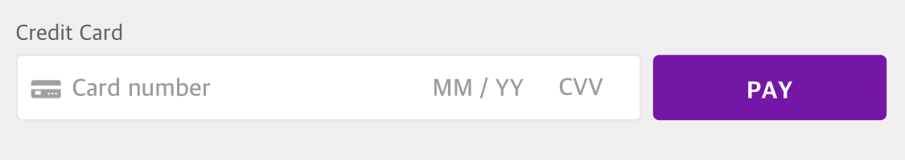

# Fields Setup Guide

## Introduction

This guide will walk you through the creation of a payment form using dLocal's all-in-one `card` Field. The `card` Field simplifies the form and minimizes the number of fields required by inserting a single, flexible input field that securely collects all necessary card details.



You can make use of dLocal Fields \(our pre-built UI components\) to create a payment form that securely collects your customer’s card information without you needing to handle sensitive card data. The card details are then converted to a representative token that you can safely send to your servers.

Creating a custom payment form with Fields requires four steps:

1. Set up dLocal Fields.
2. Create your payment form.
3. Create a token to securely transmit card information.
4. Submit the token and the rest of your form to your server.

## Before you start: **HTTPS requirements**

All submissions of payment info using Fields are made via a secure HTTPS connection. However, to protect yourself from certain forms of man-in-the-middle attacks, and to prevent your customers from seeing [Mixed Content](https://developers.google.com/web/fundamentals/security/prevent-mixed-content/what-is-mixed-content) warnings in modern browsers, you must serve the page containing the payment form over HTTPS as well.

## Step 1: Set up dLocal Fields

Fields is available as part of dLocal.js. To get started, include this script on your pages—it should always be loaded directly from [https://js.dlocal.com](https://js.dlocal.com).

`<script src="https://js.dlocal.com/"></script>`

Next, create an instance of Fields:

```javascript
var dlocal = dlocal('[you_API_key]');
var fields = dlocal.fields();
```

## Step 2: Create your payment form

To securely collect card details from your customers, Fields creates UI components for you that are hosted by dLocal. They are then placed into your payment form, rather than you creating them directly.

To determine where to insert these components, create empty DOM elements \(containers\) with unique IDs within your payment form. We recommend placing your container within a `<label>`or next to a `<label>` with a `for` attribute that matches the unique `id` of the Fields container. By doing so, the Field automatically gains focus when the customer clicks on the corresponding label.

For example:

```markup
<form action="/charge" method="post" id="payment-form">
    <div class="form-row">
        <label for="card-field">
      Credit or Debit card
    </label>
        <div id="card-field">
            <!-- A dLocal Field will be inserted here. -->
    </div>

        <!-- Used to display Field errors. -->
    <div id="card-errors" role="alert"></div>
    </div>

    <button>Pay</button>
</form>
```

When the form above has loaded, create an instance of a Field and mount it to the Field container created above:

```javascript
// Custom styling can be passed to options when creating a Field.
var style = {
  base: {
    // Add your base input styles here. For example:
    fontSize: '16px',
    color: "#32325d",
  }
};

// Create an instance of the card Field.
var card = fields.create('card', {style: style});

// Add an instance of the card Field into the `card-field` <div>.
card.mount('#card-field');
```

Fields validates user input as it is typed. To help your customers catch mistakes, you should listen to `change` events on the `card` Field and display any errors:

```javascript
card.addEventListener('change', function(event) {
  var displayError = document.getElementById('card-errors');
  if (event.error) {
    displayError.textContent = event.error.message;
  } else {
    displayError.textContent = '';
  }
});
```

## Step 3: Create a token to securely transmit card information

The payment details collected using Fields can then be converted into a token. Create an event handler that handles the submit event on the form. The handler sends the sensitive information to dLocal for tokenization and prevents the form’s submission \(the form is submitted by JavaScript in the next step\).

```javascript
// Create a token or display an error when the form is submitted.
var form = document.getElementById('payment-form');
form.addEventListener('submit', function(event) {
  event.preventDefault();

  dlocal.createToken(card).then(function(result) {
    if (result.error) {
      // Inform the customer that there was an error.
      var errorField = document.getElementById('card-errors');
      errorField.textContent = result.error.message;
    } else {
      // Send the token to your server.
      dlocalTokenHandler(result.token);
    }
  });
});
```

`dlocal.createToken` returns a `Promise` which resolves with a `result` object. This object has either:

* `result.token`: a token was created successfully.
* `result.error`: there was an error. This includes client-side validation errors.

## Step 4: Submit the token and the rest of your form to your server

The last step is to submit the token, along with any additional information that has been collected, to your server.

```javascript
function dlocalTokenHandler(token) {
  // Insert the token ID into the form so it gets submitted to the server
  var form = document.getElementById('payment-form');
  var tokenInput = document.createElement('input');
  tokenInput.setAttribute('type', 'hidden');
  tokenInput.setAttribute('name', 'dlocalToken');
  tokenInput.setAttribute('value', token.id);
  form.appendChild(tokenInput);

  // Submit the form
  form.submit();
}
```

## What's next? Create a Payment

Create a payment using the credit card token you just collected. Learn more about creating payments here:



