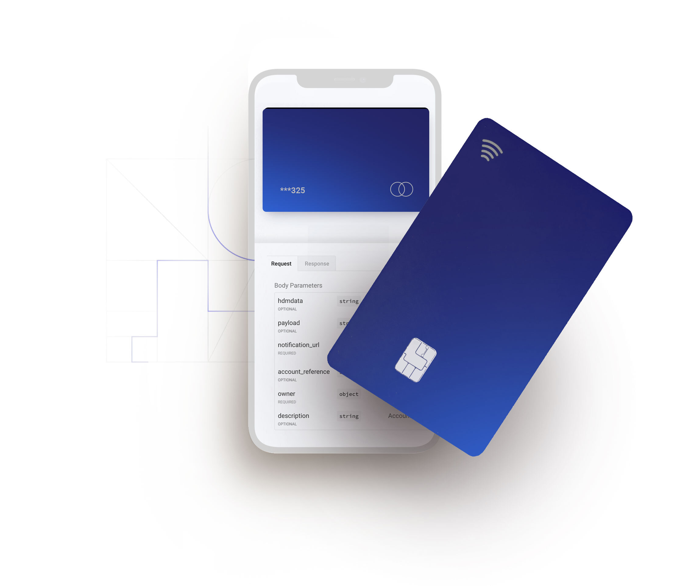

# Direct Issuing

Create new lines of revenue and easily issue prepaid cards in local currencies to reach millions of consumers in Africa, Asia and Latin America.

Issue company branded cards and send funds to cards directly to pay out partners such as drivers, homeowners or freelancers, or use it to manage loyalty programs with customers, vendors and employees. You can easily customize the card to your brand style and make funds in local currency available instantly to pay - online and offline.

### Create and manage user accounts

The solution requires you to create an account for each user you want to credit funds to. Our API allows you to easily create and manage these accounts, which includes enabling or disabling them, or retrieving relevant account information such as the balance, status or the owner's information. Follow the links bellow to learn more about these services: 





### Manage funding

Once the account is created, you can easily transfer funds to top up the user accounts in local currency. You also get access to a wide variety of   



